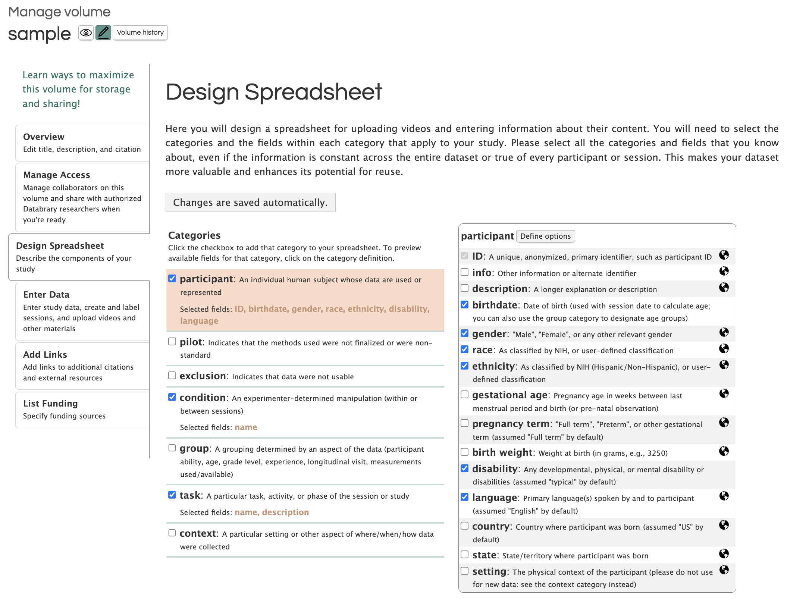
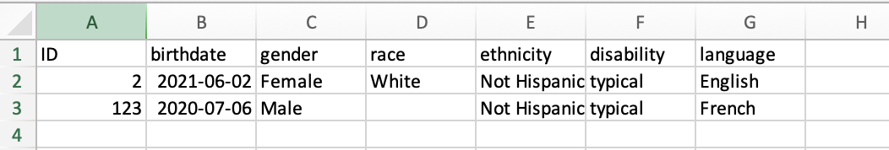
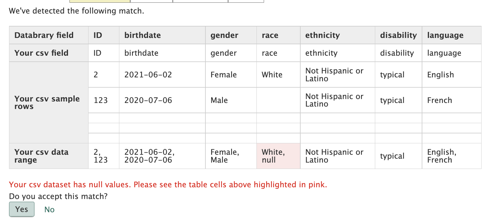

# Create a new volume {#newvol}
```{r include = FALSE}
knitr::opts_chunk$set(echo=FALSE, out.width="80%", fig.align = "center")
```
## What stage is my project  {-}

### New Project
### Ongoing
### Completed

## Step 1: Login/Go to Profile {- #step1}

Click the pink `Login` button in the middle of the [Databrary homepage](https://nyu.databrary.org/) to sign into your Databrary account.

```{r}
knitr::include_graphics("img/db-main-page.JPG")
```

Click on `Your Profile`

```{r}
knitr::include_graphics("img/db-main-page-logged-in.JPG")
```


## Step 2: Begin Create Volume {- #step2}

Click on `Create Volume` to the right of **Data Owner Volumes**

```{r}
knitr::include_graphics("img/db-create-volume.JPG")
```


There are multiple tabs on the left side of the screen that need to be completed to set up a new volume. These tabs need to be completed in order.

## Step 3: Enter Dataset Overview {- #step3}

Volume **Overview** is created by choosing if the volume is related to a published resource and answering the related questions (Title, Description, Internal Short Name and additional citation information if necessary). 

Please describe the context of data collection and the types of data uploaded (e.g. video, pictures, )

If you need this data to be associated with a DOI, please answer `YES` to the question **Does this volume correspond to a published paper or resource**

When all items are entered, select `Save`

```{r}
knitr::include_graphics("img/db-new-volume-overview.JPG")
```

You may have the option to enter Keywords associated with the Volume. See [below](#Volume) for description.

## Step 4: Manage Access {- #step4}

The **Manage Access** tab allows you to choose volume sharing options and add collaborators (faculty, staff, students) that already have an account on Databrary that is Sponsored by an Institution or an Authorized Investigator.

Do not click `Save` until you have completed both steps below.

### Step 4.1 Sharing this Volume 

Please be sure to pick the appropriate sharing setting, Private, Share Volume Overview Only or Share Entire Volume. The default sharing setting is Private.

Private: This keeps the volume private to you and your chosen affiliates and collaborators. The volume does not appear through the search functions on Databrary and only you and your chosen affiliates and collaborators will be able to view and access the volume. 

The other volume sharing settings that can be selected are "Share Volume Overview Only" or "Share Entire Volume".

Share Volume Overview Only: This will only share the title and description of the volume exactly as it is entered in the Overview tab.

Share Entire Volume: This will share the title and the description of the volume exactly as it is entered in the Overview tab. In addition, files that are shared with authorized investigators, for learning audiences, or publicly would be accessible depending on the specified file settings.

Please note: Only the Authorized Investigator who created this volume can 'Share Entire Volume'

```{r}
knitr::include_graphics("img/db-new-volume-manage-access.JPG")
```
### Step 4.2 Adding Collaborators


## Step 5: Design Spreadsheet {- #step5}

Now, go to **Design Spreadsheet** and choose all the categories and sub-categories you would like to include in your spreadsheet for participant/session metadata.

```{r}

```

### Definitions for all Spreadsheet Options 

`ID` A unique, anonymized, primary identifier, such as a participant ID.

`birthdate` Date of birth (used with session date to calculate age)

## Step 6: Enter Data {- #step6}

Now it is time to **Enter Data**. There are two options:

### Upload a participant metadata file. {- #participantmetadata}

See video instructions or follow the step by step instructions below.

```{r, out.width="90%"}
knitr::include_url("https://nyu.databrary.org/slot/27587/0,183810/asset/122478/download?inline=true")
```


What is an appropriately formatted .csv file?

- ensure that the Header row is exactly the same as the **Spreadsheet Preview** in the `Design Spreadsheet` tab.

```{r}
knitr::include_graphics("img/db-design-spreadsheet.png")
```

so this .csv file would look like:

```{r}

```

Now it is time to upload the participant .csv file. 

Click the `participant` tab. Then `Choose File` to navigate to the appropriate file. Finally click `Upload`.

```{r}
knitr::include_graphics("img/db-enter-data-participant.png")
```

You will see a window that summarizes the data uploaded and will point out any potential errors (e.g. wrong header names, missing data)

```{r}

```

Please review these data

Then click `Yes`.

Now the uploaded data will show like this.

```{r}
knitr::include_graphics("img/db-uploaded-metadata.png")
```

After the participant metadata is uploaded, the data regarding the testing session and any relevant filed get uploaded individually. 

See video instructions or follow the step by step instructions below.

```{r, out.width="90%"}
knitr::include_url("https://nyu.databrary.org/slot/27588/0,170067/asset/122480/download?inline=true")
```

Click on the `folder` tab.

Click on `add folder` and choose to add a **session** or **materials** folder.

```{r}
knitr::include_graphics("img/db-add-folder.png")
```

Session folders are for participant sessions and materials folders are for thing related to the study such as surveys used, sample consent forms, and stimuli.

Session folders need to be added individually. Once the Participant ID is entered, the related metadata will be filled in. Then the rest of the session information will need to be added individually.

### Enter Data individually (the upload as you go method) {- #individually}

- Click inside the **ID** box to add a participant. 
- Complete each metadata item selected to create the participant, then
- Add files related to that participant

```{r}
knitr::include_graphics("img/db-new-volume-enter-data.JPG")
```

## Step 7: Add Links {- #step7}

Please share more information in your Databrary Volume using **Add Links**. Here you will want to add links to any outside resources related to this dataset (e.g. published paper, github repository)

```{r}

```

## Step 8: List Funding {- #step8}

Finally, please share your funding source for your volume in **List Funding**. If your funding source is not listed here, please email Databrary Staff at contact@databrary.org to have it added.

```{r}
knitr::include_graphics("img/db-new-volume-list-funding.JPG")
```

## Volume Tags vs. Keywords{- #Volume}

What is the difference between a Tag and a Keyword?

Tag - Anyone can tag a volume
Keyword - Only Volume Owners/Authors/Investigators can enter keywords

How do Tags and Keywords affect the search function?

Tags can be searched for on the [Databrary Search Page](http://nyu.databrary.org/search)

Keywords are for??? Maybe these are the same keywords that would have been used in the associated Journal article.

Can I tag a Session?

This appears to be possible, but the search function cannot present results by session. Therefore only Volume Tags are currently searchable.
