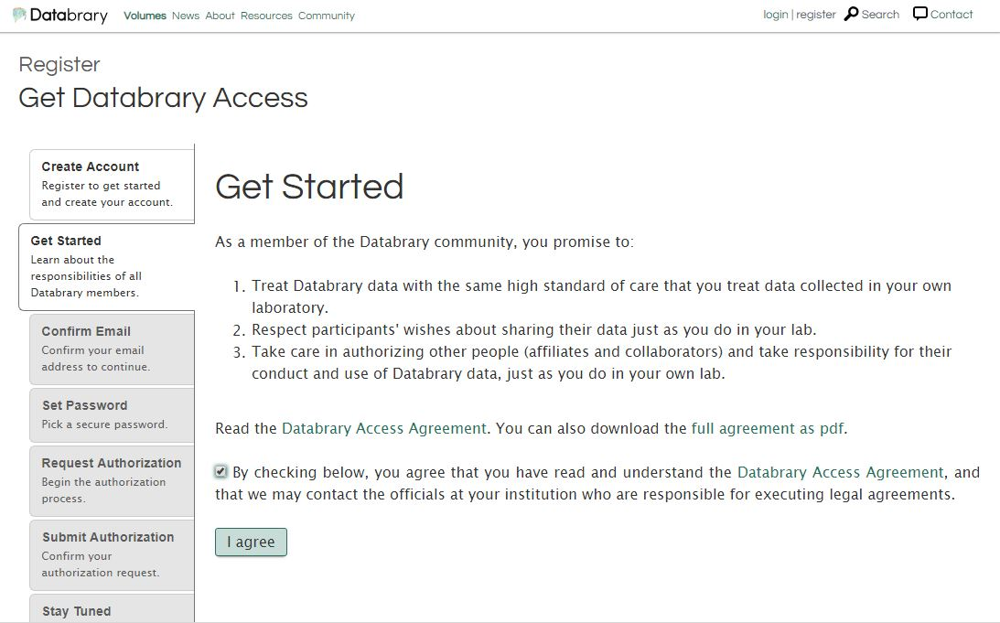
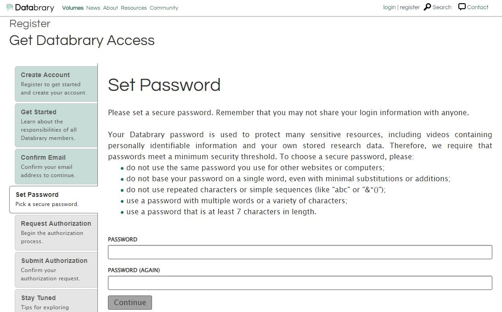
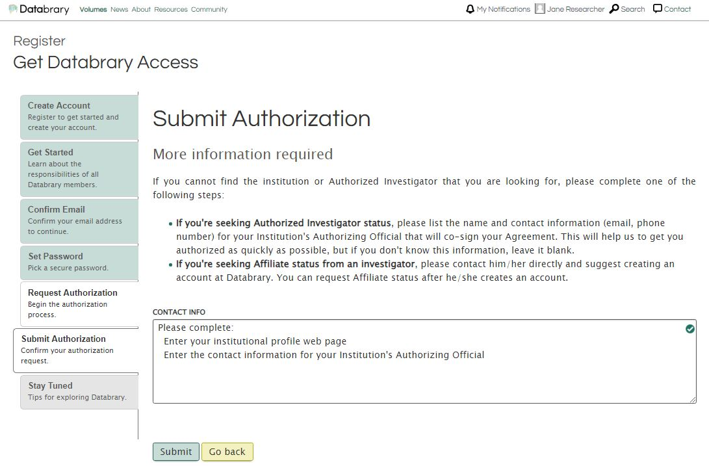

# Requesting access

## Should I register for Authorized Investigator or Affiliate Status?  

I am an **Authorized Investigator** if:  

  + I can conduct independent research;  
  + I can submit funding proposals as the lead investigator;  
  + I have Principal Investigator Status or a tenure-track faculty position at my Institution;  
  + My Institution maintains or uses an ethics board to review and approve research involving human subjects (or animals where relevant); AND
  + I have current training that addresses research ethics with human subject (or animals where relevant)    

I am an **Affiliate** if: 

  + I conduct research under the supervision of a Principal Investigator an Authorized Investigator's sponsorship; AND
  + I am a student, research staff, or post-doctoral researcher  

Your Supervisor or Research Sponsor must register as an Authorized Investigator BEFORE you may request affiliate access from them.

## How to Register for Databrary Access  

To start the authorization process on Databrary, please complete out the [Registration Form](https://nyu.databrary.org/user/register?page=create) or click `register` on the top right of the menu bar on databrary.org.  

  
Fill out the Create Account form with your full name, valid institutional email address, and the name of your research institution.

 
  
Read the [Databrary Access Agreement](https://databrary.org/about/agreement/agreement.html), [Annex I](https://databrary.org/about/agreement/agreement-annex-I.html), [Annex II](https://databrary.org/about/agreement/agreement-annex-II.html), and [Annex III](https://databrary.org/about/agreement/agreement-annex-III.html) and check the box to agree to the access terms. 

Go to your email box, locate the auto-generated email from Databrary, and confirm your email. If you don't receive the email within a few minutes, check your spam folder.  

Please choose a password.  

Decide if you are entitled to Authorized Investigator status, or are requesting affiliate status from your Supervisor or Research Sponsor.

### To register as an **Authorized Investigator** at an Institution:

1. Select the `Authorized Investigator` radio button and search for your institution. 
    * If your institution is not found in the drop down box, please select 'Other' and provide more information on the next screen.
2. This will auto-generate a notification to the Databrary team.
3. Databrary's authorization team will be in touch (typically within 24-48 business hours) to help you through the process and initiate a DocuSign envelope for signature.

### To register as an **Affiliate** of an Authorized Investigator:

You can only do this if your Supervisor or Research Sponsor ALREADY has a Databrary Account.

1. Select the `Affiliate` radio button and search for your Supervisor or Research Sponsor's name. 
2. Your Supervisor or Research Sponsor Investigator will receive a notification that you have applied for access, and can approve you. 

If you need to request Affiliate Authorization in a separate session from creating your account, you may go to your Supervisor or Research Sponsors page on Databrary and request Affiliate Access from them.

****ADD PICTURE HERE****