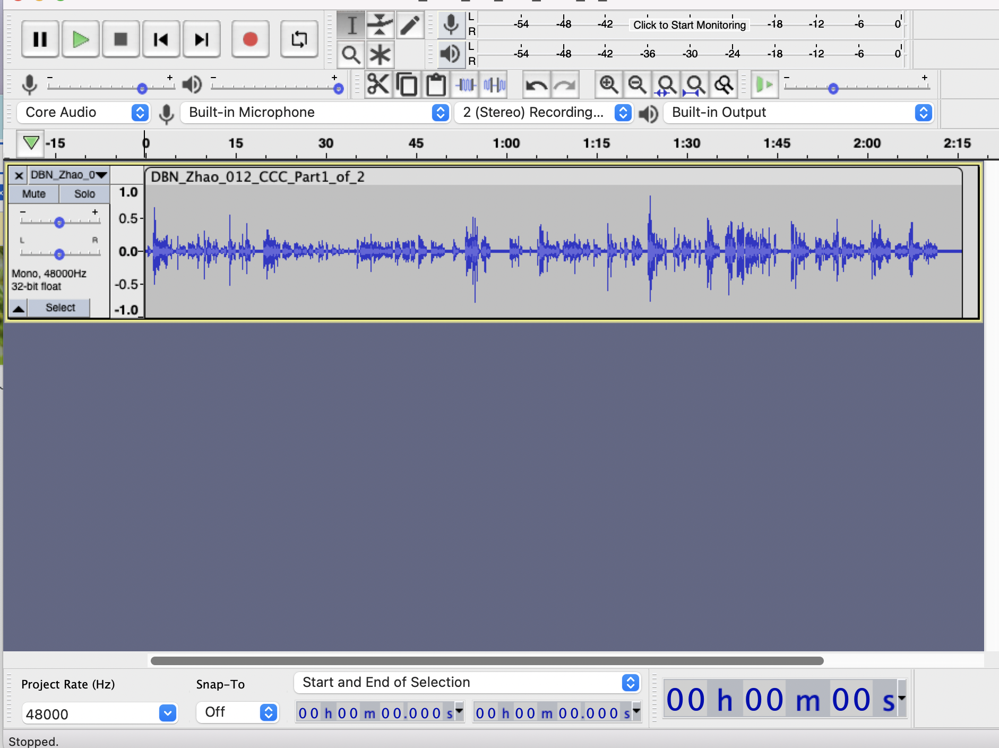
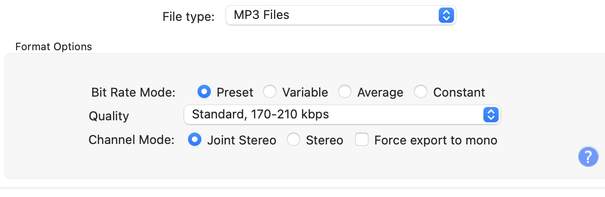

# Frequently Asked Questions

## I qualify as an Authorized Organizational Representative (AOR). Can I sign as both Authorized Investigator and AOR?  {-}

No. If you qualify as an Authorized Organizational Representative you will need to have the staff member above you on an organizational chart sign for you. 

## Can individuals not associated with an institution be authorized? {-}

No. To become an Authorized Investigator on Databrary you/your institution must meet __All__ of the below conditions:  

  - Have PI status or you are eligible to conduct independent research at this Institution and the Institution accepts responsibility for its Authorized Investigators’ actions related to the use of Databrary  
  - Have all current research ethics training that addresses human subjects policy and issues required by your institution; and  
  - Your institution must maintain an ethics or Institutional Review Board with U.S.-equivalent standards that reviews and approves research involving human subjects,  
  - Be part of an institution that grants you the authority to choose and manage affiliates who meet Databrary's qualifications and who agree to follow Databrary's ethical principles, and  
  - The person executing this Access Agreement on behalf of the Institution has the authority to do so  
  - Data on Databrary is provided for non-commercial and non-personal use only and is subject to the terms of use outlined in the Databrary Access Agreement.

## How much does Databrary cost? {-}

There is no cost to use Databrary.

## How is Databrary funded? {-}

Databrary is supported through grants from federal agencies, and private foundations.

## Where is Databrary located? {-}

Databrary is located at New York University (NYU). All data is stored on servers that are maintained by NYU IT staff.
  
## I did all registration and authorization steps on Databrary. I need to download a data set. My supervising professor has registered and gave me access but I still can't download it. {-}

Your supervising professor did register and requested access to Databrary. Access is not immediate. Your supervising professor and an authorized signatory on behalf of the university must review and approve the agreement. After Databrary receives the completed agreement, we may grant Databrary authorization to your supervising professor. The time it takes for this to be completed depends on the internal requirements of each institution.

## Does Databrary offer "blind review"? {-}

Databrary is a restricted access data repository that promotes the storage and sharing of identifiable and sensitive data. As such, Databrary has unique policies to protect the privacy of research participants. These policies govern who can access identifiable data and under what circumstances. The policies are codified in a formal access agreement that binds NYU, Databrary's parent institution, and similar institutions where Databrary's users conduct research. For the forseeable future, these policies make it impossible to support full double-blinded anonymous review of data and materials.

While some data and materials are shared with the public, Databrary restricts access to sensitive and identifiable information to people who have received authorization from an institution or to those whose access is supervised by an authorized investigator. Only authorized investigators can create and share datasets. Dataset creators, not Databrary, determine what level of sharing is appropriate for individual data files and for datasets as a whole.

So, the level of access a reviewer can have to a dataset depends on two things: Has the dataset been shared with the Databrary community? Does the reviewer have authorization from an institution to view restricted data or materials? 

If both answers are yes, the reviewer may fully vet a shared dataset. Databrary does not report on access to specific datasets, so the reviewer can remain anonymous. Databrary does not mask the identities of dataset owners, so the blinding is only one-way.

If the dataset is shared, but the reviewer does not have authorization from an institution, the reviewer can confirm that a shared dataset exists, that the dataset has a persistent identifier, and that the dataset has a specific number of shared restricted access files. The reviewer may also examine any items that are shared with the public, stimuli, protocol, aggregated and de-identified datasets, etc.

## What if an authorized investigator is leaving their institution for another institution but should still retain authorized investigator status? {-}

The authorized investigator would need to meet all criteria required for authorization at both institutions. 

## As an authorized investigator moving to another institution, do I need to be re-authorized by my new institution? How do I change my institutional affiliation on Databrary? {-]

**Answer here**

## What if a Databrary user, who was originally authorized as an affiliate, now needs be an authorized investigator on Databrary? {-}

**Answer here**

## Level of access for sessions vs. level of access for each specific file if they set a sessions folder to a specific level of access, they don't need to do it again for each of the files they upload to that session {-}

## Fix an audio file that is not playing in Databrary {-}

1. download original session from Databrary and unzip the file
2. open audacity
3. file > open
4. select the file from the appropriate folder in the downloads folder
5. Now the file shows up in audacity


```{r, out.width = "70%", fig.align = "center", fig.cap="Open an Audio File in Audacity"}

```

6. Go to File > export > export as MP3
7. use the following default parameters 

```{r, out.width = "70%", fig.align = "center", fig.cap="File Export Window in Audacity"}

```

- if your file is named incorrectly (e.g. spaces/brackets/filename truncated) please edit the filename here.

7. a window pops up called 'edit metadata tags'. just select OK

8. This new file needs to be [replaced](#replace-file) in the Databrary session folder.

## Fix a video file that is not playing in Databrary {-}

If you ever find that there are videos that don't play in Databrary, the following instructions may be helpful to you.

- use Handbrake (https://handbrake.fr/) to convert/transcode these files to .mp4 (this will change and fix the file if there is any corrupted block)
- Go back to the session
- highlight the video
- click on the pencil in the upper left corner to edit
- click on 'replace' in the upper right corner

The default settings in Handbrake should work just fine.

## Oops, I uploaded the wrong file in my session. Can I replace it? {- #replace-file}

Yes! Please follow these instructions:

1. Login to [Databrary](https://nyu.databrary.org/)
2. Click on '[Your Profile](https://nyu.databrary.org/profile)' in the center of the screen
3. Navigate to the appropriate volume
4. Then the appropriate session
5. Single Click on the file that needs to be replaced.
6. Click on the Edit Button (the small pencil)
7. Ensure the appropriate file is highlighted in gray.
8. Click 'Replace File' at the top right of the screen
9. Navigate in the files pane to the correct file then select Open

## I just uploaded a video file onto Databrary and it says my uploading is complete. Why can't I see it on or download it from Databrary right away? {-}

## I downloaded files from Databrary, but the filenames are truncated. {-}

When Databrary downloads files there is a `32 character filename limit`. Please ensure the file names do not exceed this. 

If the file name is too long (the first 32 characters of the filename are exactly the same), it is impossible to distinguish between these files when they download and only __one__ file will be downloaded.

## I have a dataset that has been completely collected. Now we are ready to share with Databrary. What do I do? {-}

<a href = "mailto: contact@databrary.org">Send an Email to Databrary</a> so they may assist you. You will need to include answers to the following questions:  

* What is the name and email address for PI for this project?  
* Do you have permission to share these data with the Databrary community?  
    + Was a [Data Sharing Release](https://databrary.org/support/irb/release-template.html) or something similar completed at the time of Data Collection?  
    + Do you have permission from your IRB or Research Ethics Board used at your institution to share these data with Databrary?   
* How many files are there for this dataset?  
* What file types do you have (e.g. .mov, .mp4, .mp3, .pdf, .xls)? [Databrary Supported File Formats](https://nyu.databrary.org/asset/formats)
* What is the total size of dataset (X GB)?  
* How many different sessions/participants do you have?  
* Do you have materials to share (e.g. data collection instructions, survey questions) in addition to the videos collected for the study?  
 
Discuss this project with the Databrary Team to determine the next steps.

1. Format your data with the same file structure for all sessions/participants

  ***insert picture examples***
  
  
  
2. Share data folder with the <a href = "mailto:andrea.seisler@databrary.org"> Databrary Support Specialist </a> on Box.
3. Create list of files using Terminal (how to find terminal on [Windows](https://www.makeuseof.com/windows-11-open-windows-terminal/#:~:text=This%20is%20how%20you%20can,Terminal%20to%20open%20that%20app.) and [Mac](https://support.apple.com/guide/terminal/open-or-quit-terminal-apd5265185d-f365-44cb-8b09-71a064a42125/mac#:~:text=Open%20Terminal&text=Click%20the%20Launchpad%20icon%20in,%2C%20then%20double%2Dclick%20Terminal.))
    a. find [path to folder with files] > out.txt 
    b. E.g. find /Users/username/Box/Data_for_Databrary > out.txt 
4. Download [ingest_template.xls](https://github.com/databrary/curation/tree/master/spec/templates)  by opening the link, then click on the filename and select download.  
    a. Details for what needs to be completed on these templates are found   [here](https://github.com/databrary/curation/blob/master/spec/metadata.md)  
        i. Make sure the items in the required columns are completed for each file.  
            - the table `Session Metadata` describes the fields in the `sessions_template.csv`  
            - the table `Participant Metadata` describes the fields in the `participants_template.csv`   
        ii. The participantID on the sessions_template and participants_template must match   
        iii. `key` is typically the same as `participantID`    
    b. It may be easier to complete `ingest_template.xlsx` then save each tab as a .csv  
        i.   participants_template.csv  
        ii.  sessions_template.csv  

## I have a multi-site study. Is there a recommendation on volume/file naming schemes? {-}

Try naming the each Volume: ProjectName_SITEID

`The Short Name is INTERNAL only to volume Investigators and Collaborators`

Where each SITEID has a unique id to each site, typically with the same number of characters.

Each file uploaded can have a standard naming scheme which includes the SITEID.

In the Volume Description, list the name of the university/institution in full. This allows for use of an API pull to ingest data when necessary.

After all data are collected, a new volume with __ALL__ of the final data, including which data are from which site, can be created.

## I have a multisite study. How do I add my co-investigators in the right order to the Databrary volume? {-}

## I am an authorized investigator. What is the best practice for revoking access to affiliates who originally were in my lab but have left? {-}

## Regarding permissions for users. We anticipate that we will have a range of users including faculty, professional developers, graduate students. We think getting access will be pretty straightforward for individuals connected to a university. However, how would someone (e.g., professional developer in a school district) gain access? {-}

## Is there a maximum file size? We have some multigig videos and want to check ahead of time if there is a limit {-}

## Is there a storage capacity limit for each project? {-}

  
