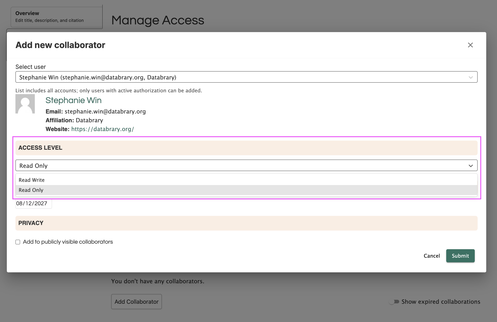
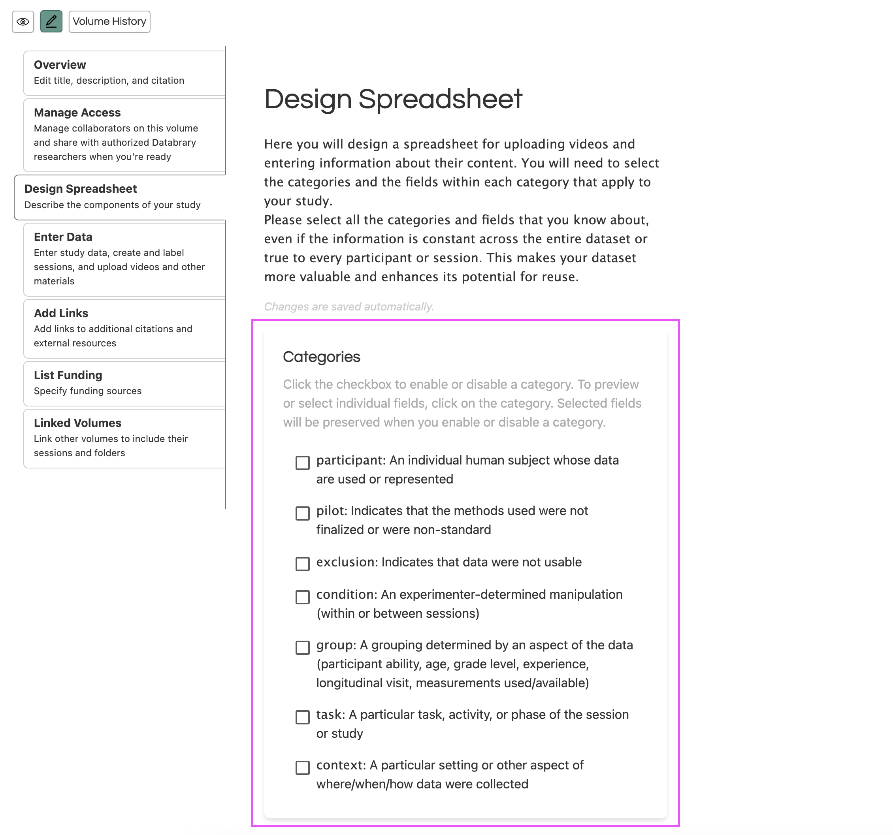
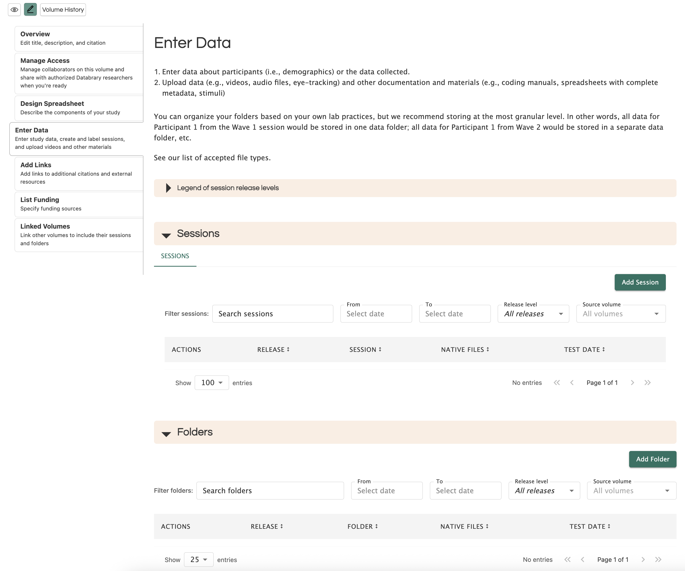
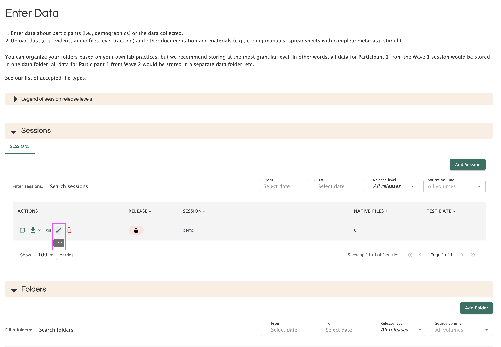
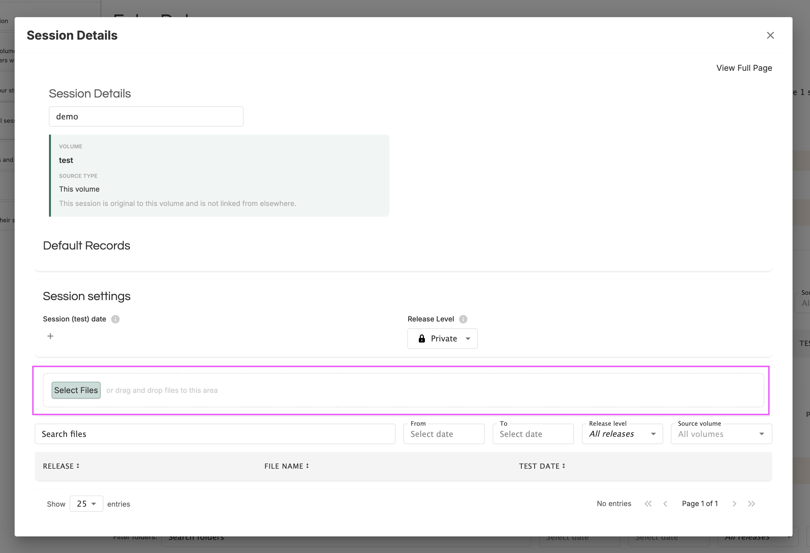
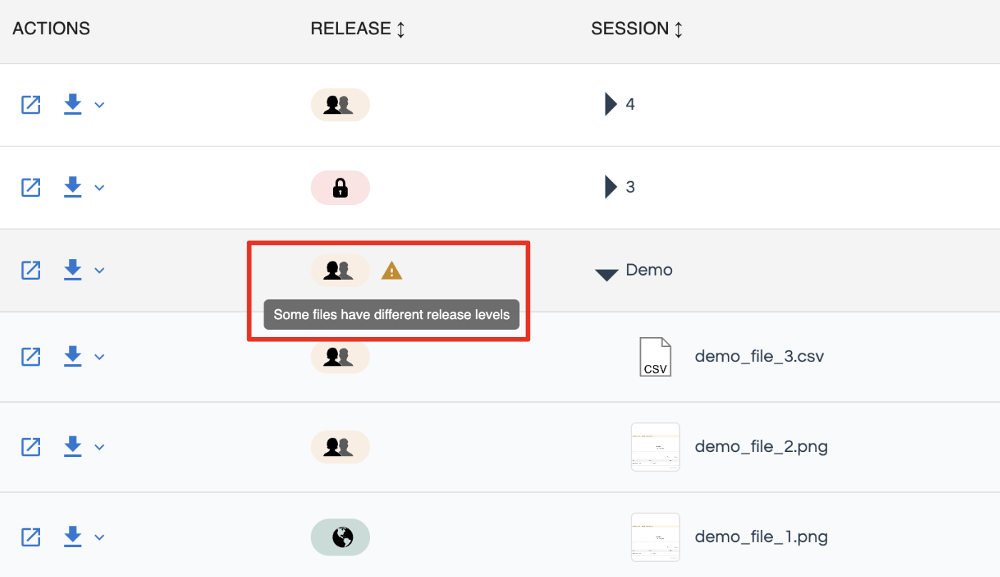
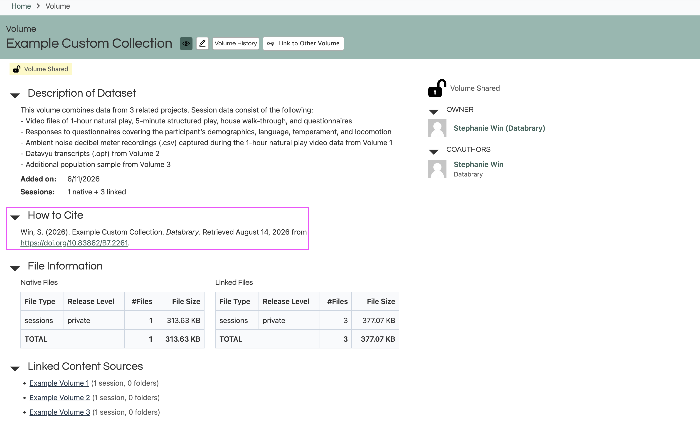

# Contributing Data {.unnumbered}

To contribute data to Databrary, you can create a new volume that will hold the collection of data or materials associated with your research project.

## Setting up Volume

### Step 1: Create a Volume

Click on 'Create Volume' in the right side of your top navigation bar.

::: callout-note
Only Authorized Investigators with an active Databrary Access Agreement can create a volume.
:::

```{r echo=FALSE}
knitr::include_graphics("img/step-1.png")
```

### Step 2: Volume Overview

The Volume Overview contains information about the Title, Description, Internal Short Name and key words.

```{r echo=FALSE}
knitr::include_graphics("img/volume-overview.png")
```

Please describe the context of data collection and the types of data that will be uploaded (e.g. video, pictures, coding files, survey data, etc.).

#### **Title**

The title could be the title of the publication or a good description of the tasks and/or data involved. For better reuse and discoverability, the title should be informative to external researchers.

#### **Description of Dataset**

Below is an example format for the description of the dataset:

> This dataset focuses on \[Provide provide a description of behavor, location of study, and age range\]. Dataset includes \[Enter description of tasks, videos, questionnaires, materials, etc.\].

> Videos were \[Provide a general description of what the videos were coded for ie., transcribed for mother speech and child vocalizations; coded for mother and child object interaction; child locomotion and emotion).\].

> This volume contains \[List the types of files along with approximate numbers for each. Some examples are provided below\]:
>
> - *xx* videos (MP4/MOV files)
> - *xx* of Datavyu transcription files (OPF files)
> - *xx* of Datavyu coding files (OPF files)
> - Questionnaire data (.xls file)
> - Several video exemplars of child behaviors (.mp4 files)
> - Transcription manual (.docx file)
> - Coding manual (.docx file)
> - Scripts for processing and exporting data from Datayu (Ruby)
> - Materials folder containing stimuli, copies of questionnaires used in study, additional participant demographic information, and other materials utilized for the study.
> - Exemplar study intake video of experimenter with participant

You may not have a complete description of your dataset when you first create your volume. It is best practice to fill out as much information as you have and continue to add more information as your dataset becomes more complete.

The description can also include the abstract of the paper or any associated products.

#### **Internal Short Name**

The only people who can see the internal short name are you and your Supervised Researchers. You can use whatever lab convention makes the most sense to you.

#### **Keywords**

Only Volume Owners, Co-Authors, and Authorized Investigators can enter keywords. It is best practice to use keywords that would have been used in the associated journal article.

### Step 3: Manage Access

Here, you can choose volume sharing options (ie., shared, overview only, or private) and add collaborators (faculty, staff, students) that already have an account on Databrary that is Sponsored by an Institution or an Authorized Investigator.

```{r echo=FALSE}
knitr::include_graphics("img/manage-access.png")
```

#### **Sharing Level**

**Private**: The volume is private to you and your chosen Supervised Researchers and volume collaborators.

**Volume Overview Only**: The volume's title and description is visible to authorized Databrary users.

**Shared**: The volume and its contents are visible, accessible and downloadable to authorized Databrary users.

::: callout-important
The sharing level controls public Databrary visibility for your volume. Databrary users will not be able to see your volume and its contents unless your volume is shared.
:::

::: callout-note
Only the volume owner can share the volume.
:::

#### **Owner**

Databrary requires that volumes have a **single owner**. Volume owners can transfer ownership of their volume to another Authorized Investigator, to a registered institution or to Databrary.

Transferring ownership typically happens when the data ownership should be under a co-PI or when an Authorized Investigator moves to a new institution.

When you move to a new institution, you’ll need to work with the relevant parties at your institution and your new institution to determine if and how data you collected there may be transferred to your new institution or be retained by your old institution. This determination is independent of Databrary. You will likely also want to locate where local records of the data are stored.

::: callout-important
We advise that Databrary not be the sole source of storage for any research data.
:::

Different institutions make different determinations about data transfer, which can depend on the institutions involved, type of data, project status, and source of funding. We have seen cases where data collected and contributed to Databrary become owned by the original institution (i.e., the old institution becomes the volume owner on Databrary) or they are transferred to another institution and you remain the volume owner (with your new institution sponsoring your Databrary access).

#### **Coauthors**

Coauthors are people who should get scholarly credit for your volume. Including someone as a coauthor means their name will show up in the volume citation and the DOI once it gets minted.

::: callout-note
Co-authorship does not affect who has access to your volume. If you would like to grant access to your volume, you must add them as a colalborator.
:::

#### **Collaborators**

Collaborators are your Supervised Researchers, co-PIs, or external collaborators that have access to your volume and can view, edit, and/or manage your dataset.

##### **Collaborator Access Levels**

```{r echo=FALSE}

```

- **Read Only**: Collaborator can view and download the datasets in the volume but they will not be able to edit anything.
- **Read/Write**: Collaborator can view, download, and edit the datasets in the volume.
- **Manager**: Collaborator can view, download, and edit the datasets in the volume. They can also create new volumes with the supervising Authorized Investigator as the owner. In addition, managers can manage all collaborators on the volume and add or remove collaborators.

### Step 4: Design Spreadsheet

Here, you can choose all the categories and sub-categories you would like to include in your spreadsheet for participant and session metadata. You will need to select the categories and the fields within each category that apply to your study.

```{r echo=FALSE}

```

Please select all the categories and fields that you know about, even if the information is constant across the entire dataset or true to every participant or session. This makes your dataset more valuable and enhances its potential for reuse.

::: callout-note
You can always add or remove categories from your volume at any point and the metadata will be retained.
:::

## Entering Data

Now, you can add your data to the volume! You must ensure that you have appropriate participant permissions to share data on Databrary. Please navigate to our [Obtaining Permissions page](/ethics/data-collection-and-permissions.qmd) to learn more about obtaining the appropriate participant permissions.

```{r echo=FALSE}

```

#### **Session vs. Folder**

Sessions are used for data related to participant sessions. A session usually involves data from an individual participant while they performed a task or tasks in a specific study location at a defined time. 

Folders are used for materials related to the study such as surveys, sample consent forms, and stimuli. Some cases that you would use a folder for are:

- Exemplar videos
- Coding spreadsheets
- Coding manual
- Coding scripts
- Analysis scripts
- Processed data
- .readme file on how to use the data

#### **Creating a Session or Folder**

Sessions and folders need to be added individually. Once the Participant ID is entered, the related metadata will be filled in. Then, the rest of the session information will need to be added individually.

#### **Adding Files to a Session or Folder**

To add files to a session or folder:

1.  Find the name of the session or folder that you wish to add files to.
2.  Click the 'edit' icon which will open up a session details page.

```{r echo=FALSE}

```

3.  You may upload files by either dragging and dropping them into the outlined space or by clicking and selecting the files you wish to upload.

```{r echo=FALSE}

```

#### **Release Levels**

When you have obtained your participant permission, you must determine which Databrary sharing release level should be used for your participant's data.

```{r echo=FALSE}
knitr::include_graphics("img/release-levels.png")
```

The release levels will dictate the level of access to your data once your volume is **shared**.

##### **Session Release Level**

The session release level automatically sets the same release level for all files uploaded under that session from that point forward.

```{r echo=FALSE}
knitr::include_graphics("img/session-release-level.png")
```

When you first create a session, the release level is automatically set to private. If you would like to change the release level, you must edit it manually.

::: callout-note
Changing the session release level does not automatically apply the same release level to existing files under the session. You must update the file release levels manually if you would like it to match the new session release level.
:::

##### **File Release Level**

The file release level is set for a particular file or data asset uploaded under that session that is more or less restrictive than the session release level.

::: callout-note
If there are files with less restrictive release levels in your session, your session release level column will display an alert.

```{r echo=FALSE}

```
:::

## Sharing the Volume

When the volume is ready ie., when a paper goes to press or a grant period ends, the volume owner can share the volume with all authorized Databrary users. This is controlled in the 'Manage Access' tab.

Sharing the volume makes the data contained in the dataset available to authorized Databrary users, but only in accordance with the session, folder, and file release levels selected by the volume owner and volume collaborators. Individual data files marked Private remain accessible only to people the volume owner specifically selects.

Once your volume is shared, Databrary will automatically mint a DOI for your volume. This DOI is distinct from any published journal article and can be used to directly index your Databrary volume.

The DOI will replace the Databrary volume URL.

```{r echo=FALSE}

```

## Example Volumes
These are volumes that you can refer to for guidance about creating a robust Databrary volume:

- [Practice and proficiency: Factors that facilitate infant walking skill](https://nyu.databrary.org/volume/1273)
- [The impact factor in infant development: Falling like a baby](https://nyu.databrary.org/volume/1042)
- [Infant exuberant object play at home: Immense amounts of time-distributed, variable practice](https://nyu.databrary.org/volume/1118)
- [How Mothers Help Children Learn to Use Everyday Objects](https://nyu.databrary.org/volume/1567)
- [The cost of simplifying complex developmental phenomena: A new perspective on learning to walk](https://nyu.databrary.org/volume/89)
- [Falls experienced by older adult residents in long-term care homes](https://nyu.databrary.org/volume/739)
- [Health Effects of Unaffordable Water](https://nyu.databrary.org/volume/1550)

