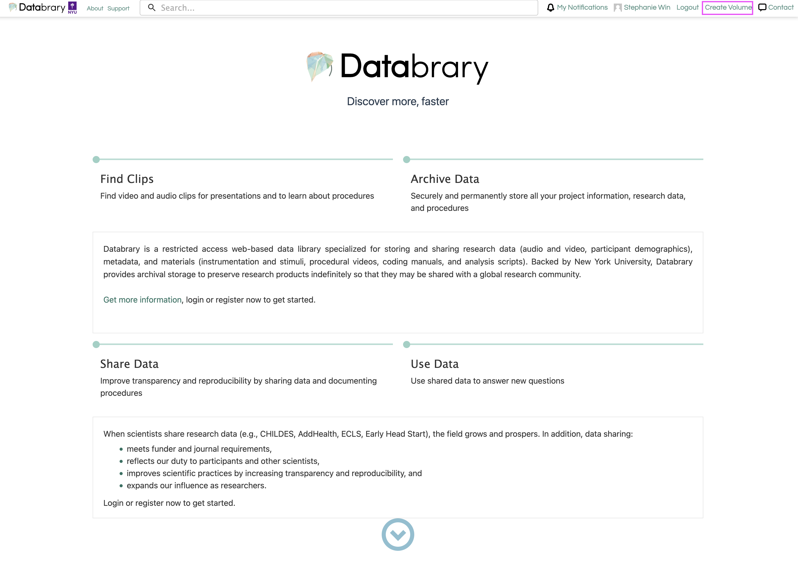
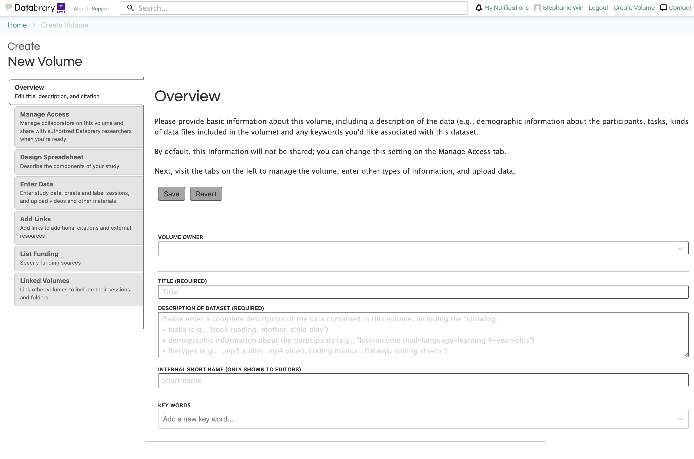
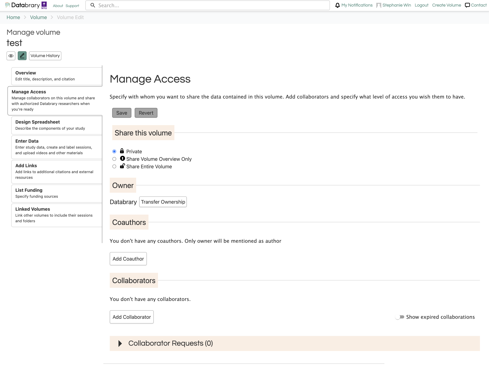
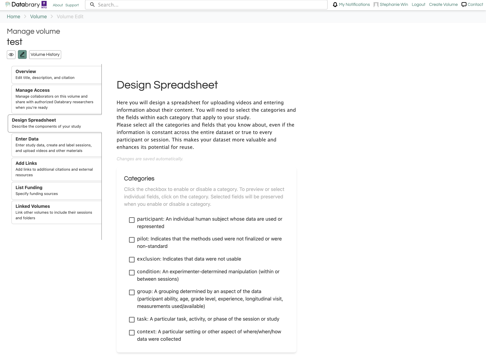
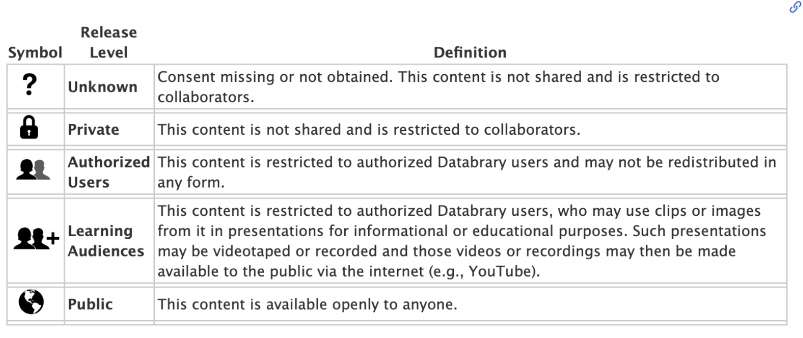
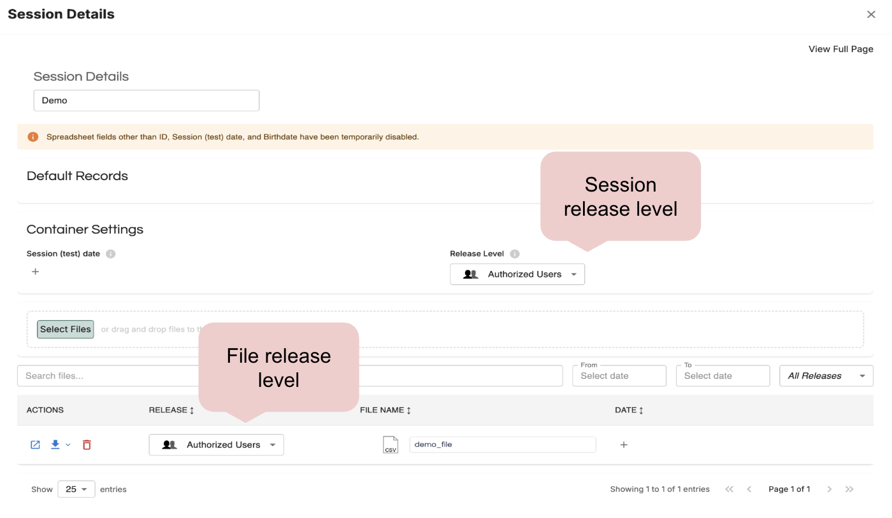

# Contributing Data {.unnumbered}

*## Setting up Volume*
*## Entering Data*
*## Sharing Volume*

To contribute data to Databrary, you can create a new volume that will hold the collection of data or materials associated with your research project. 

## Step 1: Create a Volume

Click on 'Create Volume' in the right side of your top navigation bar.

*Include callout note that only authorized investigators can create a volume*

```{r echo=FALSE}

```

## Step 2: Volume Overview

The Volume Overview contains information about the Title, Description, Internal Short Name and key words.

```{r echo=FALSE}

```

Please describe the context of data collection and the types of data that will be uploaded (e.g. video, pictures, coding files, survey data, etc.). Below is a recommended template for each field: 

### Title
*The title could be the title of the publication or a good description of the tasks or data involved. For better reuse and discoverability, the title should be informative to researchers*

### Description of Dataset
This dataset focuses on [Provide provide a description of behavor, location of study, and age range]. Dataset includes [Enter description of tasks, videos, questionnaires, materials, etc.].

Videos were [Provide a general description of what the videos were coded for ie., transcribed for mother speech and child vocalizations; coded for mother and child object interaction; child locomotion and emotion).].

This volume contains [List the types of files along with approximate numbers for each. Some examples are provided below]:

- *xx* videos (MP4/MOV files)
- *xx* of Datavyu transcription files (OPF files)
- *xx* of Datavyu coding files (OPF files)
- Questionnaire data (.xls file)
- Several video exemplars of child behaviors (.mp4 files)
- Transcription manual (.docx file)
- Coding manual (.docx file)
- Scripts for processing and exporting data from Datayu (Ruby)
- Materials folder containing stimuli, copies of questionnaires used in study, additional participant demographic information, and other materials utilized for the study.
- Exemplar study intake video of experimenter with participant

*You may not have a complete description of your dataset when you first create your volume. It is best practice to fill out as much information as you have and continue to add more information as your dataset becomes more filled out. The description can also include the abstract of the paper or any associated products.*

### Internal Short Name
The only people who can see the internal short name are you and your Supervised Researchers. You can use whatever lab convention makes the most sense to you. 

### Keywords
Only Volume Owners, Co-Authors, and Authorized Investigators can enter keywords. It is best practice to use keywords that would have been used in the associated journal article.

## Step 3: Manage Access
Here, you can choose volume sharing options (ie., shared, overview only, or private) and add collaborators (faculty, staff, students) that already have an account on Databrary that is Sponsored by an Institution or an Authorized Investigator.

```{r echo=FALSE}

```

### Sharing Level
**Private**: The volume is private to you and your chosen Supervised Researchers and volume collaborators.

**Volume Overview Only**: The volume's title and description is visible to authorized Databrary users.

**Shared**: The volume and its contents are visible, accessible and downloadable to authorized Databrary users.

*Emphasize that this controls public Databrary visibility for your volume*

### Collaborators

*Include screenshots for add collaborator modal and the different roles. Explain owner is only one that can share, what is a co-author, why to transfer volumes*

## Step 4: Design Spreadsheet

Here, you can choose all the categories and sub-categories you would like to include in your spreadsheet for participant and session metadata. You will need to select the categories and the fields within each category that apply to your study. You can always add or remove categories from your volume at any point and the metadata will be retained.

```{r echo=FALSE}

```

Please select all the categories and fields that you know about, even if the information is constant across the entire dataset or true to every participant or session. This makes your dataset more valuable and enhances its potential for reuse.

*Include definitions of spreadsheet categories*

## Step 5: Enter Data
Now, you can add your data to the volume! You must ensure that you have appropriate participant permissions to share data on Databrary. Please navigate to our [Obtaining Permissions page](/ethics/data-collection-and-permissions.qmd) to learn more about obtaining the appropriate participant permissions.

Once you have obtained your participant permission, you must determine which Databrary sharing release level should be used for your participant's data. 

```{r echo=FALSE}

```

The release levels will dictate the level of access to your data once your volume is **shared**.

*Include information from 'Add Data' from old guide*

### Session Release Level
The session release level automatically sets the same release level for all files uploaded under that session.

```{r echo=FALSE}

```

### File Release Level


