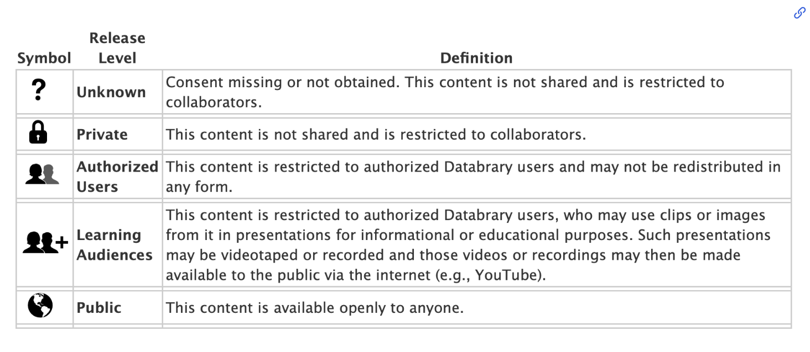

# Data Collection and Permissions {.unnumbered}

The first step in data collection is ensuring you obtain participant's permission to share their data on Databrary. It is best practice to have a data release form as well as a standardized script when requesting participant's permission to share their data on Databrary. 

## Sample Data Release Forms

Linked are sample data release forms for:

- [Participants](https://databrary.org/support/irb/release-template)
- [Lab Staff](https://databrary.org/support/irb/staff-release)

## Sample Script

> Now that you have finished this session, there’s one more thing we want to ask you. The data that researchers collect from babies and families are incredibly valuable for helping scientists to understand how children develop.
>
> So we wanted to ask if you are comfortable with allowing us to share the data we collected from this session with other researchers just like the professor who runs this lab/project. The data would be shared in a secure, online library, it’s not available to the public– only researchers that are authorized by their University would be able to access the information in the library.
> 
> This permission form also asks whether you would allow other professors/ researchers like Dr. [PI’s Name] to show short bits of the videos to students or researchers for educational and scientific purposes. These data will not be used or shown for commercial purposes. 

## Example Video

Below are example videos of researchers requesting participant's permission to share their data on Databrary:





## Sharing Data Collected Without a Databrary-Specific Release {-}

If you already use a video/audio or photo release form and want to find out whether you can share with Databrary, follow the following steps.

### Seek Formal Permission From Your IRB {-}

If your release permits you to show recordings in educational or scientific settings, you may apply for formal permission from your IRB to share these recordings with Databrary. 

::: {.callout-note}

Databrary intends to store data indefinitely.
Some IRBs encourage researchers to include promises to destroy data, especially recordings, after some fixed time period in order to limit risk to participants.
Data destruction is antithetical to data sharing, and Databrary's Template Release language seeks explicit permission to share data indefinitely. 
NIH and NSF do not require data destruction. 
Researchers who wish to store Data on Databrary should remove data destruction clauses from their informed consent documents for new data and seek IRB guidance about whether archival data can be shared.

:::

### Determine Sharing Release Level

You must ensure that your permission release level matches the correct Databrary sharing release levels.

```{r echo=FALSE}

```


### Share Data with Databrary {-}

You may [create a new volume](../project-guidelines/new-project.qmd) yourself or contact Databrary for help in doing so.