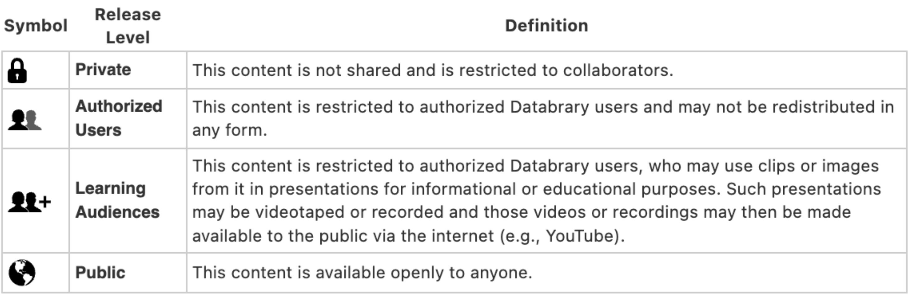

# Specifics {.unnumbered}

## The Databrary Access Agreement {-}

Databrary restricts access to Authorized Investigators whose Institutions sign a formal [Databrary Access Agreement](../more-information/definitions.qmd#def-daa).

The Databrary Access Agreement combines provisions for data use and data contribution. Unlike data use agreements that allow specific individuals access to a particular dataset for a discrete research purpose, the Databrary Access Agreement allows any Authorized Investigator to access all shared volumes on Databrary and use the volumes for many different Institutionally-approved purposes. 

In addition, the Databrary Access Agreement permits Authorized Investigators to upload data and to share it with other Authorized Investigators in accord with the sharing permissions granted by participants and any required Institutional approvals. 

Databrary believes that combining data use and data contribution in a single agreement reduces barriers to data sharing, meets emerging funder mandates to share research data, and accelerates progress in research.

## The Use of Video Extends Beyond Research  {-}

In addition to its many uses in research, video may be used for a variety of pre-research and non-research uses, such as:

- Documentation of methodological details
- Demonstration of computer-based tasks
- Demonstration of video clips for teaching or scientific presentations

Databrary encourages the storage and sharing of video for all of these purposes, in a manner consistent with subject permissions and
institutional approvals.

## When to Involve a Research Ethics Board or IRB  {-}

Databrary does not require prior research ethics board or IRB approval for an Authorized Investigator to be granted access to the system or to use Databrary's shared resources for non-research, educational, or pre-research uses.

However, in signing the Databrary Access Agreement, all Authorized Investigators agree to secure research ethics approval whenever their use of Databrary requires it under the Institution's policies.
Institutions determine which cases require research ethics board or IRB review and approval.

## What Data are Shared  {-}

Databrary stores and shares:

- Images, video, and audio recordings that may be identifiable
- Data and metadata that are not typically sensitive
- De-identified data

Exact birth dates may be stored for use in calculating participant ages, but exact birth dates are only exposed to Authorized Investigators or Sponsored Researchers given specific access to the data.

Names, addresses, email addresses, financial information, government ID numbers, detailed geographic location information, and other personally identifiable data elements are **not** stored and shared on Databrary.

## Securing Permission to Share Data {-}

In order to contribute and share identifiable data with Databrary,
Authorized Investigators must secure permission from research participants and any other people (e.g., research staff) who are recorded to store the recordings on Databrary.

Databrary has developed a [Sharing Release Template](../ethics/data-collection-and-permissions.qmd) that informs people depicted in recordings of the potential risks associated with sharing video and other data on Databrary. 

The Sharing Release Template is one of the resources that Databrary has made available to researchers. The template may be adapted for use at any Institution and added to any research ethics or IRB protocol. However, an Institution may require other release language in order to provide equivalent protections.

Whether de-identified or pseudonymized data may be shared with Databrary
without seeking explicit permission from research participants depends
on the Authorized Investigator's Institution. Some ethics boards or
IRBs may allow de-identified or pseudonymized data to be shared without
the explicit permission of the research participant.

## Uploading Data and Assigning Sharing Permission Levels  {-}

Authorized Investigators who upload data to Databrary must assign the level of data sharing granted by research participants to each file uploaded.

```{r echo=FALSE}

```

The sharing level assigned to each file by default is **Private**, meaning that no person other than the Authorized Investigator who uploaded the file and any Sponsored Researchers granted
access by the Authorized Investigator, may view the file.

All newly created volumes are initially made **Private**, accessible
only to an Authorized Investigator, any Sponsored Researchers the Authorized Investigator selects, and any other individual Authorized Investigators granted specific access to the volume 

An Authorized Investigator may decide to create an overview of a volume when it is created and make the overview publicly available. The overview can serve as the public face of the volume while the data is being collected and analyzed. This can be useful in documenting progress on a research grant to sponsors. The volume overview does not expose data until the Authorized Investigator chooses to share the volume publicly.

## Sharing Data on Databrary  {-}

The Authorized Investigator decides when to share the volume with other Authorized Investigators on Databrary. Typically, Authorized Investigators share the volume when a paper goes to press or a grant period ends.

This makes the data contained in the volume available to other Authorized Investigators and possibly the public, in accordance with the sharing levels selected by Authorized Investigators and to the permission granted by participants. For example, individual data files marked **Private** remain accessible only to people the Authorized Investigator specifically selects. Similarly, access to volumes labeled **Private** remains solely under the control of the Authorized Investigator.

## Databrary and GDPR  {-}

Authorized Investigators may collect personal data from research
participants who have rights under the General Data Protection
Regulation (GDPR). GDPR governs the collection of personal data in the
European Economic Area (EEA).

Databrary's servers are currently located in the United States, and
data stored on Databrary may be accessed, downloaded, and re-used by
Authorized Investigators and their Sponsored Researchers located outside of the EEA. There are more than 800 Institutions across the globe that have signed the Databrary Access Agreement. 

Databrary maintains a list of Authorized Investigators who have access to shared research data [here](https://nyu.databrary.org/search?volume=false&f.party_authorization=4&f.party_is_institution=false).

In seeking permission to collect data from research participants
governed by GDPR or similar provisions, Authorized Investigators should
communicate to research participants information about who may have
access to shared data on Databrary and where the data are stored.
Institutions and Authorized Investigators assume responsibility for
ensuring that research participants give sharing data permission that
satisfies the provisions of GDPR and for abiding by other provisions of
GDPR.

Databrary does not typically store information that links a participant's
identity to specific files unless there is a separate agreement between
the Authorized Investigator, the Institution, and Databrary to store
this type of data. **Therefore, if a research participant requests a copy
of data stored on Databrary or the modification or deletion of personal
data that is stored on Databrary, the Authorized Investigator or
Institution is responsible for responding to the request, not Databrary.**

Databrary cannot guarantee that data previously shared with other
Authorized Investigators via Databrary can be retrieved from all
Authorized Investigators who accessed a participant's personal data
prior to its modification or removal. Thus, Authorized Investigators
should communicate to research participants that there are limits to a
participant's right to modify or delete personal data that have already
been shared on Databrary. The [Sharing Release Template](../ethics/data-collection-and-permissions.qmd) contains
language for this purpose.

When accessing data shared by other Authorized Investigators,
Institutions and their Authorized Investigators assume responsibility
for ensuring that the sharing permission research participants have
given in other contexts outside of the EEA meet relevant GDPR
provisions.