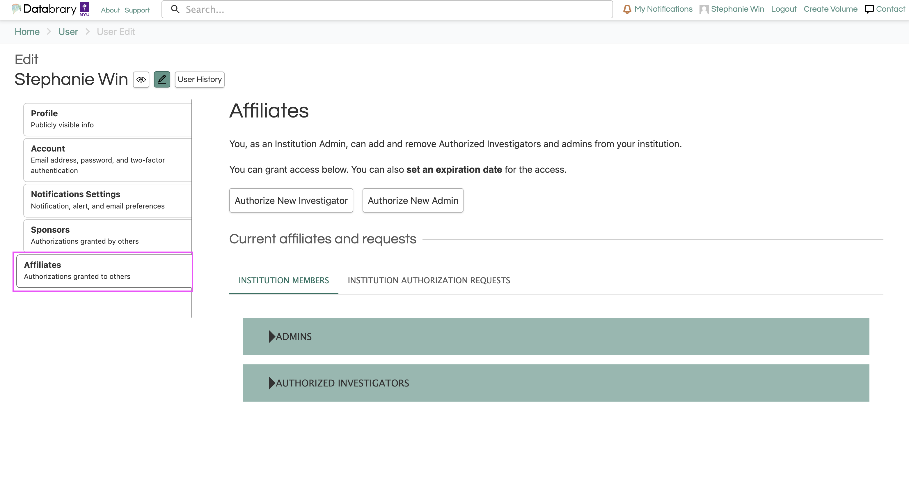

# Approving Sponsorship {.unnumbered}

After you have registered as a Databrary Authorized Investigator, you can request and grant Sponsored Researcher access to your students, research staff, and post-doctoral researchers.

## How to Grant Access to Sponsored Researchers

1. Log in to your Databrary account.
2. Navigate to your profile by clicking on your name in the top-right corner. 
```{r echo=FALSE}
knitr::include_graphics("img/navigate-profile.png")
```
3. Click on the 'edit' button next to your name.
```{r echo=FALSE}
knitr::include_graphics("img/edit-profile.png")
```
4. Navigate to the 'Sponsored Researchers' page to review your sponsored researcher requests.
```{r echo=FALSE}

```

::: {.callout-important}
Sponsored Researchers will not have access to non-public data on Databrary until *after* the Authorized Investigator has submitted all paperwork to Databrary and has granted the Sponsored Researcher appropriate access.
:::


