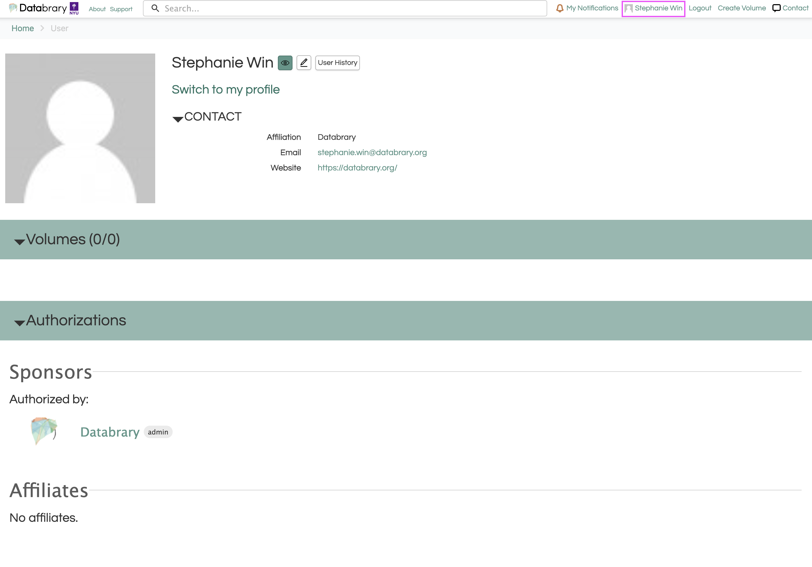
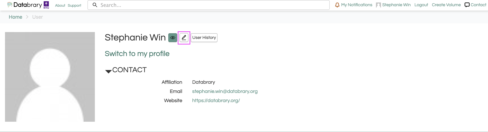
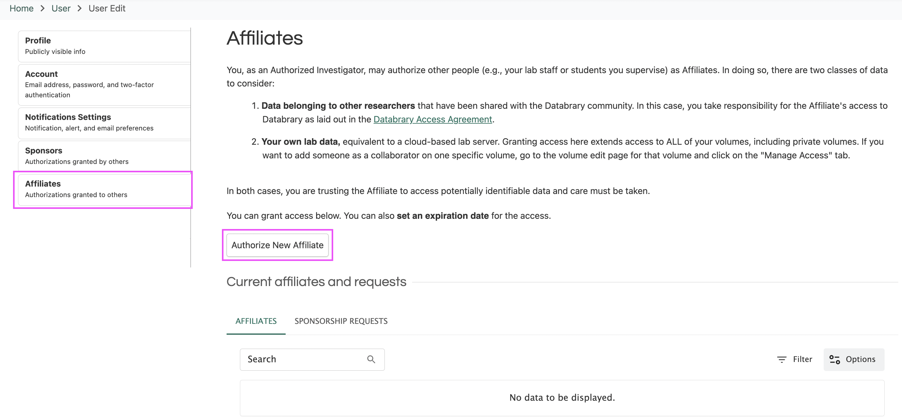
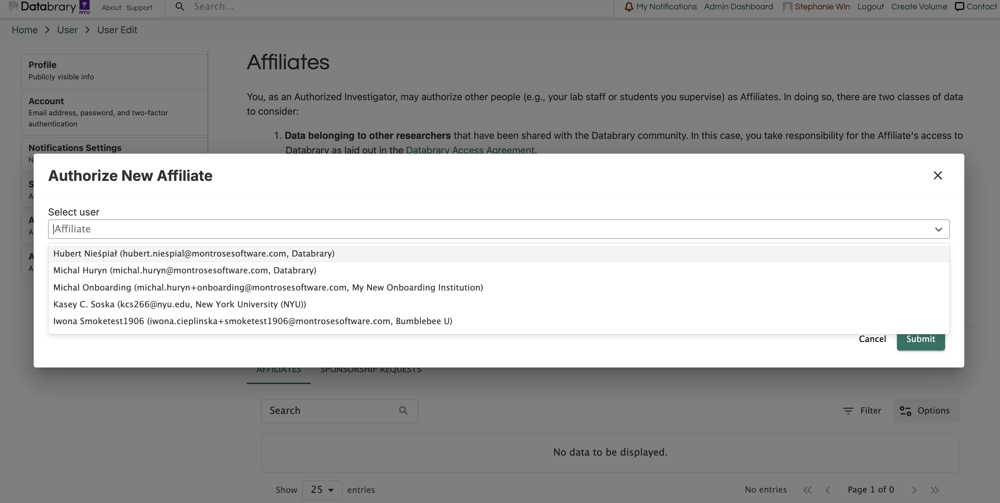
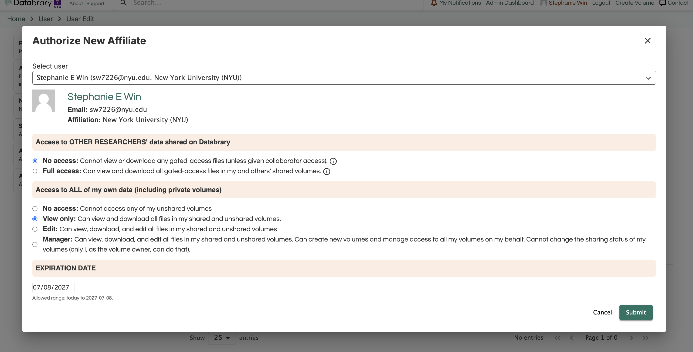

# Approving Affiliates (Supervised Researchers) {.unnumbered}

After you have registered as a Databrary authorized researcher, you can request and grant affiliate (supervised researcher) access to your students, research staff, and post-doctoral researchers.

::: callout-note
If permitted by their institution, an authorized researcher may sponsor a person outside of their institution and grant them affiliate (supervised researcher) status. Institutions may establish policies governing the selection and management of affiliates (supervised researchers) by their authorized researchers.

If this individual needs access to your volumes, after they have authorized researcher status, they can be added as a **collaborator**.

If you are eligible to be an authorized researcher at your home institution, you must apply for access to Databrary through your home institution. Except in unusual circumstances, researchers eligible to be authorized researchers at your home institution should not be granted access to Databrary as the affiliate (supervised researcher) of another authorized researcher either from the same institution or a different one.
:::

## How to Grant Access to Affiliates (Supervised Researchers)

1.  Log in to your Databrary account.
2.  Navigate to your profile by clicking on your name in the top-right corner.

```{r echo=FALSE}

```

3.  Click on the 'edit' button next to your name.

```{r echo=FALSE}

```

4.  There are two ways you can authorize affiliates (supervised researchers). Navigate to the 'Affiliates' page to authorize a new affiliate (supervised researchers) or review your sponsorship requests.

```{r echo=FALSE}

```

::: panel-tabset
## Authorize New Affiliate (Supervised Researcher)

Type in the name of the person you would like to supervise.

```{r echo=FALSE}

```

## Sponsorship Requests

Select the person you would like to supervise.

```{r echo=FALSE}

```
:::

5.  Review the type of access you are granting to your affilaite (supervised researcher) and set the expiration date of their sponsorship.

```{r echo=FALSE}

```

**Access to other researcher's data shared on Databrary:**

- Granting **no access** restricts your affiliate (supervised researcher) from accessing non-public data on Databrary. Non-public data include data that have release levels set to private, authorized users, and learning audiences.
- Granting **full access** allows your affiliate (supervised researcher) to access other researcher's non-public data on Databrary. They will be able to view data that have release levels set to authorized users, learning audiences, and public.

**Access to all of my own data (including private volumes):**

- Granting **no access** restricts your affiliate (supervised researcher) from accessing your unshared volumes. They can only access your data after you have shared it on Databrary.
- Granting **read only (view) access** allows your affiliate (supervised researcher) to view and download your shared and unshared data.
- Granting **read/write (edit) access** allows your affiliate (supervised researcher) to view, download, upload, modify, and delete your shared and unshared data.
- Granting **manager access** allows your affiliate (supervised researcher) to create new volumes on your behalf. They can also view, download, upload, modify, and delete your shared and unshared data.

::: callout-note
Your affiliate (supervised researcher) **cannot** share your volume with any access level. Only you as the volume owner can share your volume.
:::

**Expiration Date:**

- The expiration date for your affiliate (supervised researcher) can be set to a maximum of one year. Databrary recommends setting the expiration date to shorter than one year.
- To manage all of your affiliates (supervised researchers) at once, you can [bulk edit]() your affiliates (supervised researchers) to renew their access. 

::: callout-important
Affiliates (supervised researchers) will not have access to non-public data on Databrary until after the authorized researcher has submitted all paperwork to Databrary and has granted the affiliate (supervised researcher) appropriate access.
:::
