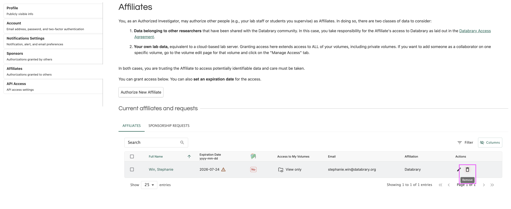
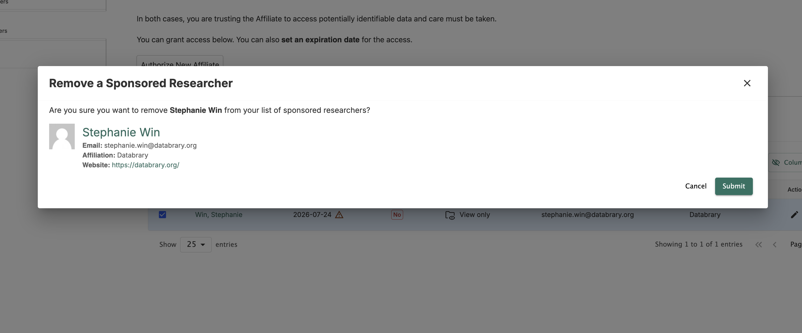

# Removing Supervised Researchers {.unnumbered}

If your supervised researcher is no longer working under your research supervision or at your institution, you should remove their sponsorship status. 

If they still need access to your collaborative data on Databrary, they must apply for sponsorship through their new research supervisor. Once their sponsorship is approved, you can add them as a collaborator on your volumes. 

### How to Remove Your Supervised Researcher

1. Click the 'Remove' icon.

```{r echo=FALSE}

```

2. Review and confirm the information in the pop-up modal to remove your supervised researcher.

```{r echo=FALSE}

```