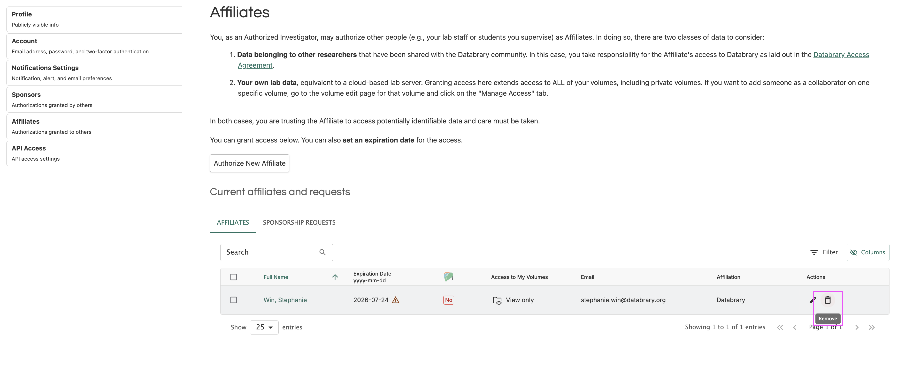
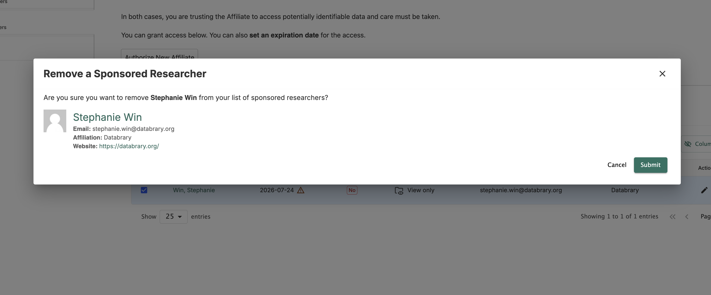

# Removing Affiliates (Supervised Researchers) {.unnumbered}

If your affiliate (supervised researcher) is no longer working under your research supervision or at your institution, you should remove their access.

If they still need access to your collaborative data on Databrary, they must apply for sponsorship through their new research supervisor. After their access is approved, you can add them as a collaborator on your volumes.

### How to Remove Your Affiliate (Supervised Researcher)

1.  Click the 'Remove' icon.

```{r echo=FALSE}

```

2.  Review and confirm the information in the pop-up modal to remove your affiliate (supervised researcher).

```{r echo=FALSE}

```
