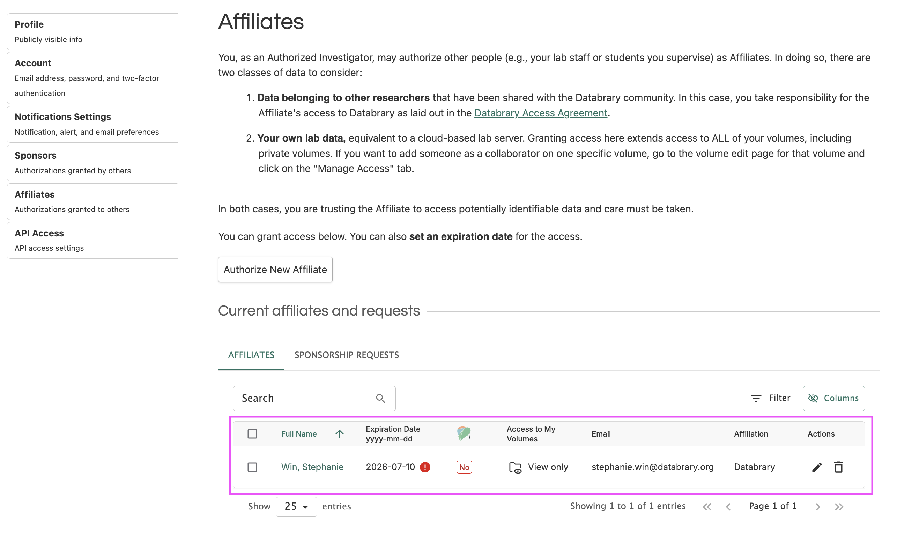
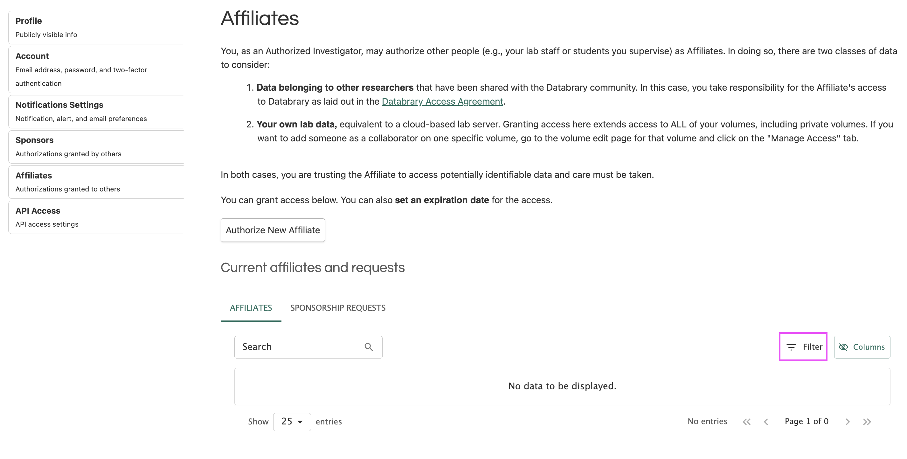
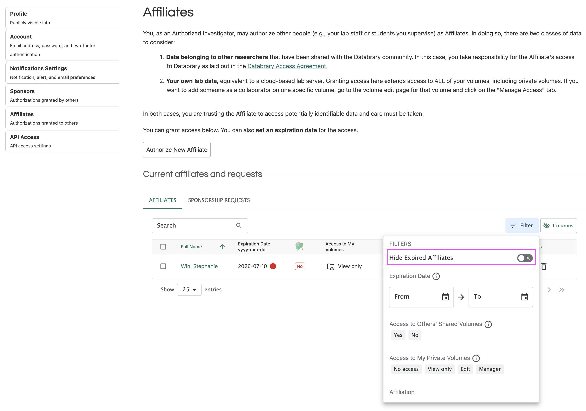
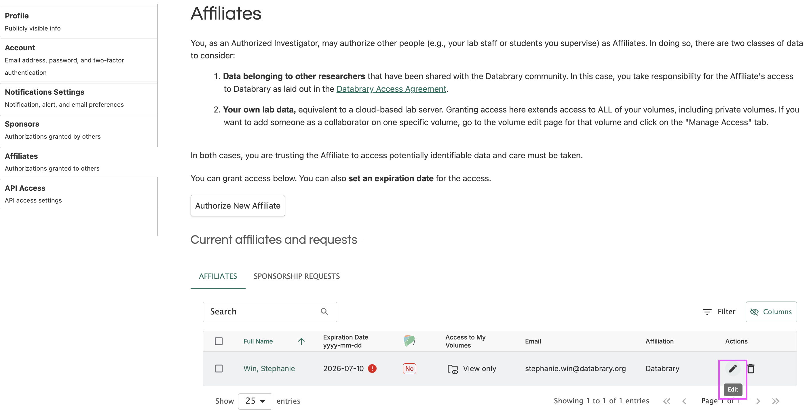
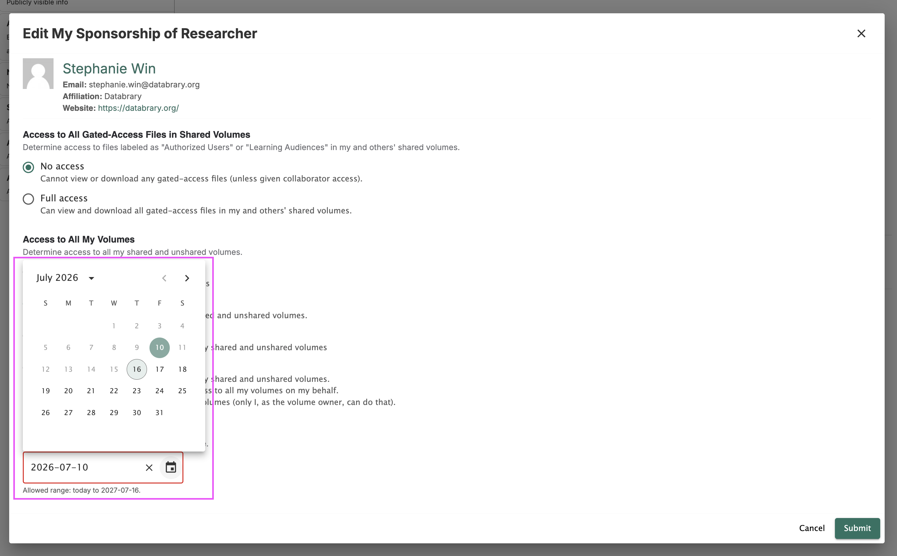

# Renewing Sponsorship {.unnumbered}

All supervised researcher's sponsorships will expire on a date defined by you or by the default one year expiration date. Before your supervised researcher's sponsorship expires, you will receive a notification from Databrary reminding you to renew their sponsorship if needed.

```{r echo=FALSE}
knitr::include_graphics("img/expire-email.png")
```

::: {.callout-note}
You can customize how you would like to be notified of your supervised researcher's expiring sponsorship through your notifications settings. For more guidance on how to manage your notifications settings, navigate to [this section](profile-management/managing-my-account.qmd).
:::     

## Viewing Your Expired Supervised Researchers

In the Affiliates page, you can view all of your expired supervised researchers. 

```{r echo=FALSE}

```

Sometimes, your expired supervised researchers will not be readily displayed. To display your expired supervised researchers:

1. Select 'Filter' to open up your filters menu.

```{r echo=FALSE}

```

2. From here, toggle off 'Hide Expired Affiliates'.

```{r echo=FALSE}

```

## How to Renew Sponsorship

1. Click the 'Edit' icon to review and update your supervised researcher's access and expiration date.

```{r echo=FALSE}

```

2. Select the 'Expiration Date' field to input your supervised researcher's new expiration date.

```{r echo=FALSE}

```