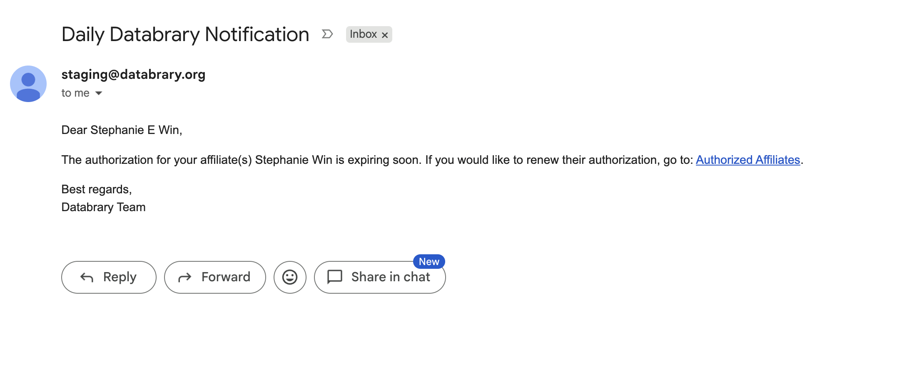

# Renewing Sponsorship {.unnumbered}

All Supervised Researcher's sponsorships will expire on a date defined by you or by the default one year expiration date. Before your Supervised Researcher's sponsorship expires, you will receive a notification from Databrary reminding you to renew their sponsorship if needed.

```{r echo=FALSE}

```

::: {.callout-note}
You can customize how you would like to be notified of your Supervised Researcher's expiring sponsorship through your Notifications Settings. For more guidance on how to manage your Notifications Settings, navigate to [this section](profile-management/managing-my-account.qmd).
:::     