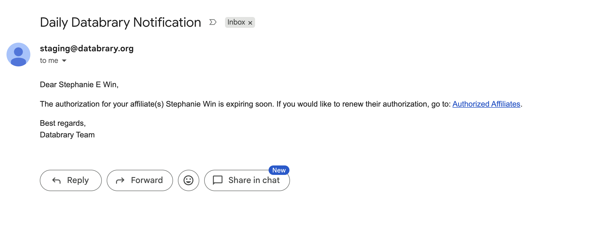
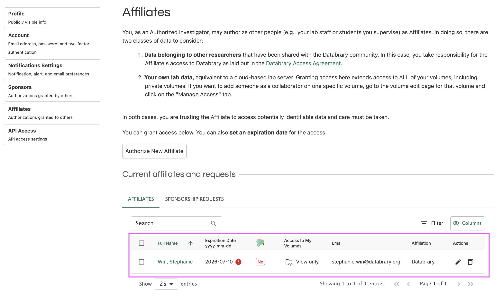
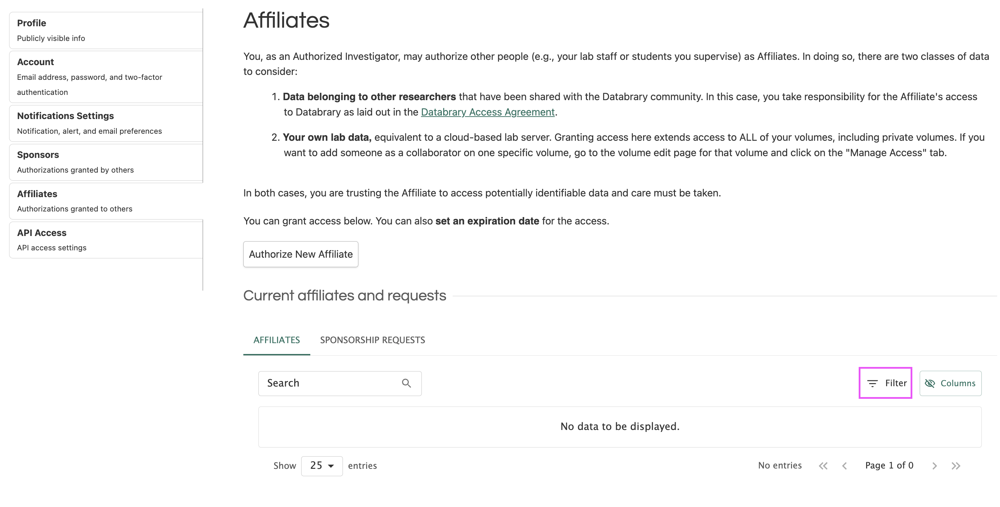
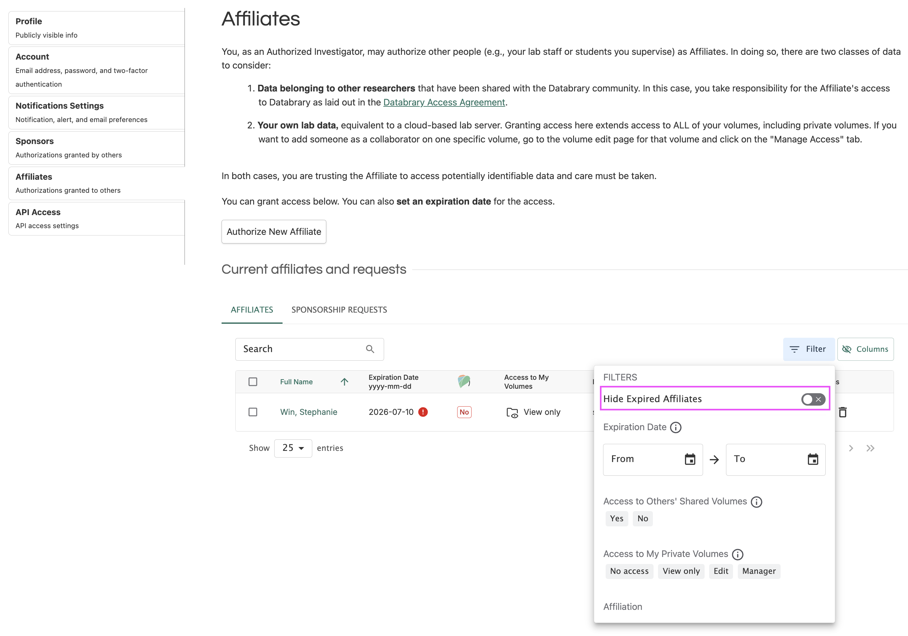
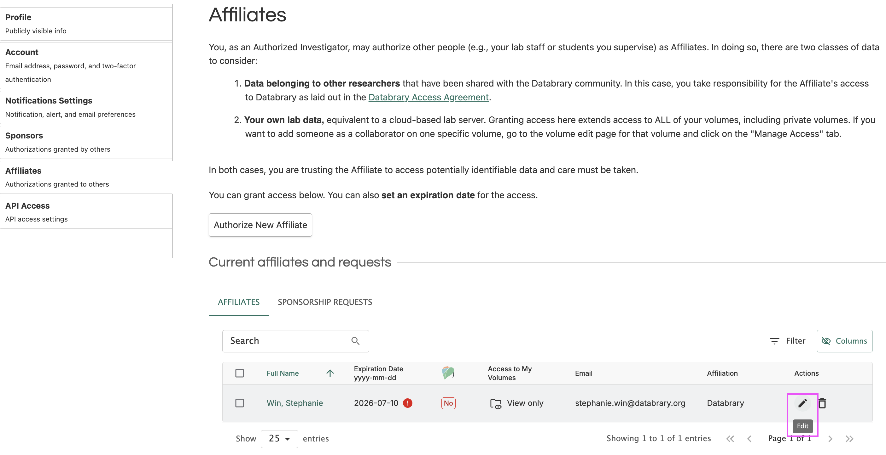
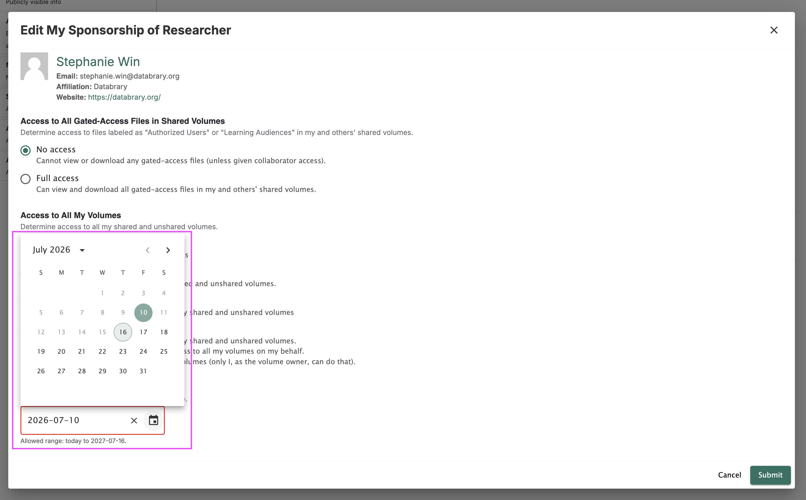

# Renewing Access {.unnumbered}

All affiliate's (supervised researcher's) sponsorships will expire on a date defined by you or by the default one year expiration date. Before your affiliate's (supervised researcher's) sponsorship expires, you will receive a notification from Databrary reminding you to renew their access if needed.

```{r echo=FALSE}

```

::: callout-note
You can customize how you would like to be notified of your affiliate's (supervised researcher's) expiring sponsorship through your notifications settings. For more guidance on how to manage your notifications settings, navigate to [this section](profile-management/managing-my-account.qmd).
:::

## Viewing Your Expired Affiliates (Supervised Researchers)

In the 'Affiliates' page, you can view all of your expired affiliates (supervised researchers).

```{r echo=FALSE}

```

By default, your expired affiliates (supervised researchers) will be hidden. To display your expired affiliates (supervised researchers):

1.  Select 'Filter' to open up your filters menu.

```{r echo=FALSE}

```

2.  From here, toggle off 'Hide Expired Affiliates'.

```{r echo=FALSE}

```

## How to Renew Sponsorship

1.  Click the 'Edit' icon to review and update your affiliate's (supervised researcher's) access and expiration date.

```{r echo=FALSE}

```

2.  Select the 'Expiration Date' field to input your affiliate's (supervised researcher's) new expiration date.

```{r echo=FALSE}

```

## How to Bulk Edit Sponsorship

1.  Click on all the affiliates (supervised researchers) that you want to edit.

```{r echo=FALSE}
knitr::include_graphics("img/bulk-select-affiliates.png")
```

2.  You can choose to update the access level and expiration date for the selected affiliates (supervised researchers) or remove access.

```{r echo=FALSE}
knitr::include_graphics("img/bulk-edit.png")
```

```         
2.  To bulk edit:
```

```{r echo=FALSE}
knitr::include_graphics("img/edit.png")
```

    2.  To bulk delete:
    
```{r echo=FALSE}
knitr::include_graphics("img/delete.png")
```