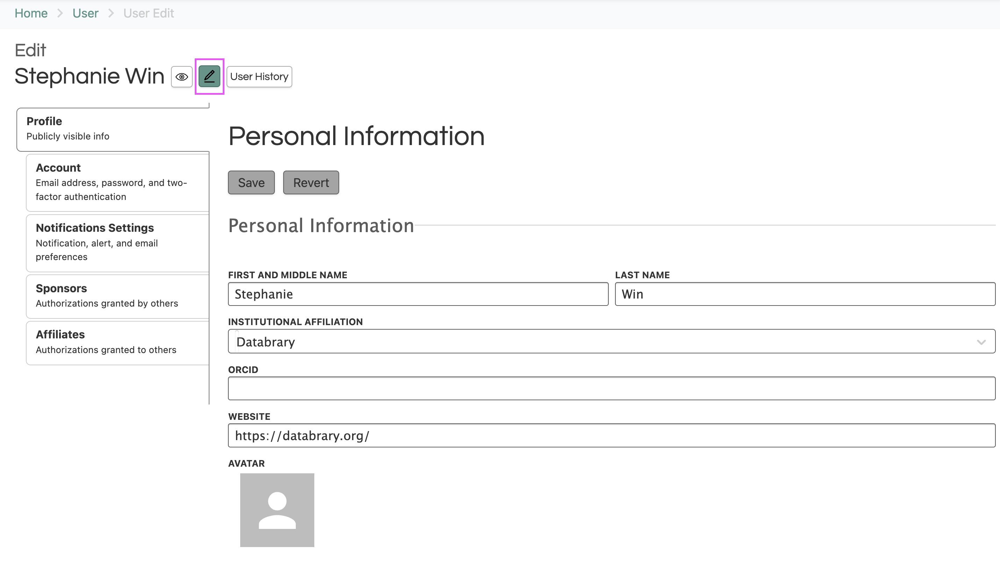
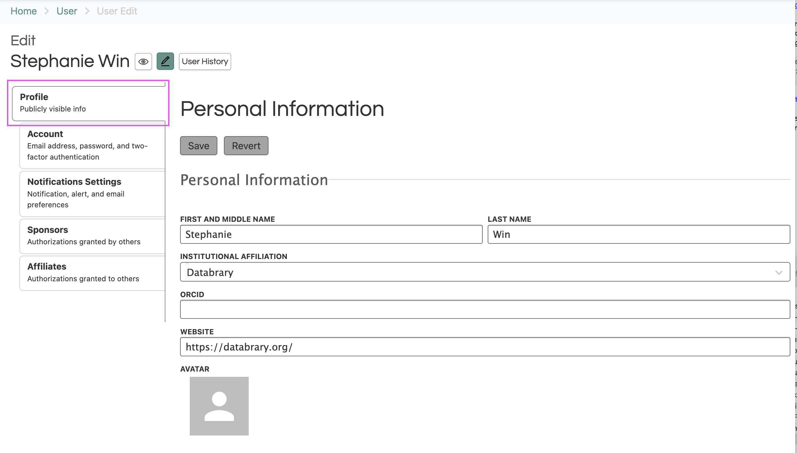
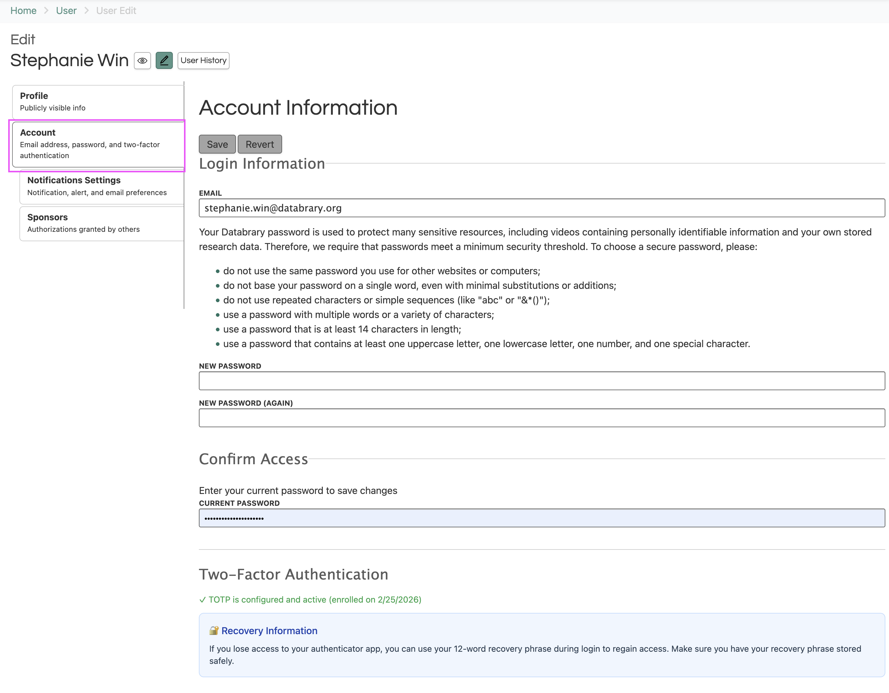
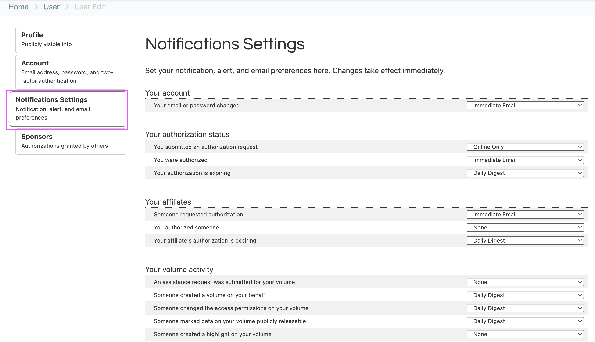
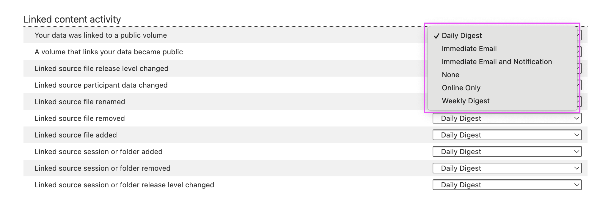
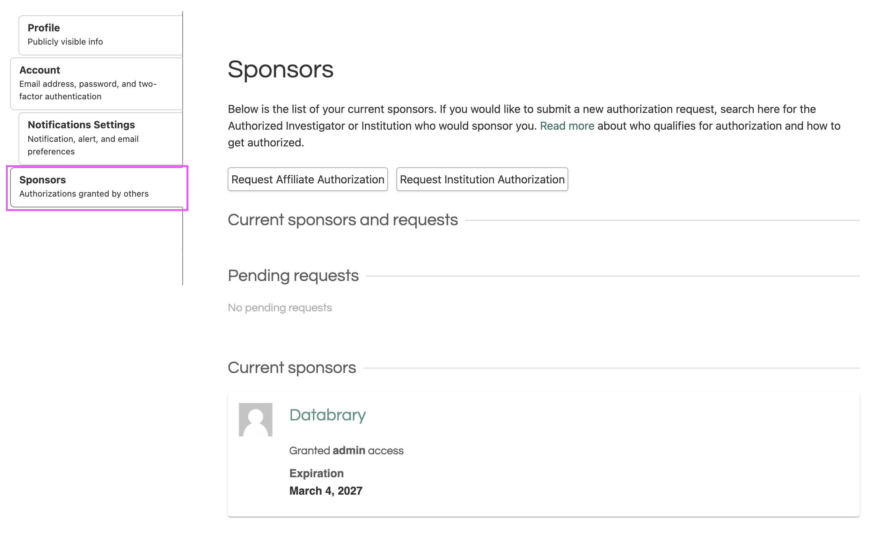

# Managing My Account {-}

You can manage your personal information, account information, notifications, sponsors, and sponsored researchers in your account settings by clicking on the pencil icon.

```{r echo=FALSE}

```

## Editing Your Personal Information

Your profile contains your publicly visible personal information. In this section, you can add and update your name and ORCID, select your institutional affiliation, and add a link to a relevant website (i.e. personal profile page on your institution's website).

```{r echo=FALSE}

```

## Editing Your Account Information

Your account contains your login information and two-factor authentication status. 

```{r echo=FALSE}

```

## Editing Your Notifications Settings

Your notifications settings is where you can set your notification, alert, and email preferences for:

- Your account
- Your authorization status
- Your affiliates
- Your volume activity
- Sitewide activity
- Newsletter subscription
- Download status
- Transcoding status
- File upload status
- Linked content activity

```{r echo=FALSE}

```

You can set your preferences to be: 

- **Immediate Email**: An email is sent right away as soon as the triggering event occurs. No in-app notification is created for this option.
- **Immediate Email and Notification**: The user receives both an immediate email and an in-app notification for the same event at the same time.
- **Online Only**: The user only receives an in-app notification, which is visible in the notifications panel on the site, and no email is sent. If the user has push notifications enabled, they may also get a push notification.
- **Daily Digest**: Notifications for the event are batched and sent once per day in a single summary email, delivered each morning at approximately 6:30 AM EST.
- **Weekly Digest**: Notifications for the event are batched and sent once per week in a single summary email, delivered Sunday mornings at approximately 5:00 AM EST.
- **None**: No notification is sent at all for that event type.

```{r echo=FALSE}

```

Databrary does not control your personal notification settings.

## Editing Authorizations and Supervision 

Description of why sections are split

::: {.panel-tabset}

## Supervised Researchers
Your sponsors page is where you can request authorization from your research sponsor(s) and institution(s), review sponsorship requests, and review the institutions and people currently sponsoring you. 

```{r echo=FALSE}

```

## Authorized Investigators

If you are an Authorized Investigator, your affiliates page is where you can review, approve, and renew authorization requests from your research staff, post-docs, or students. 

```{r echo=FALSE}
knitr::include_graphics("img/affiliates.png")
```

You can find more information about how to manage your supervised researchers in this section, [Managing Supervised Researchers](../managing-my-sponsored-researchers.qmd).

:::

