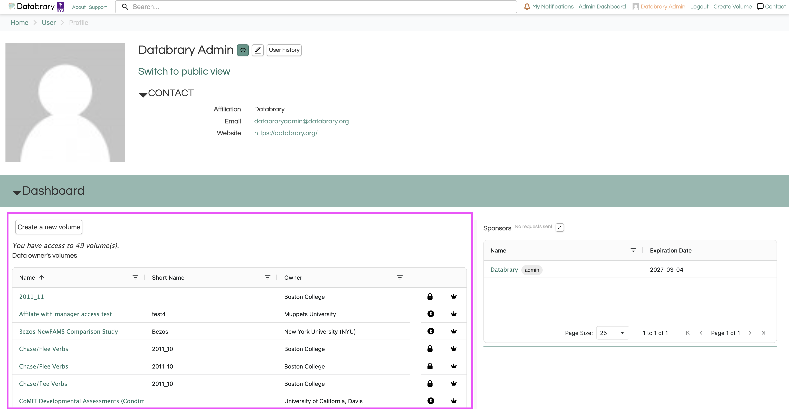
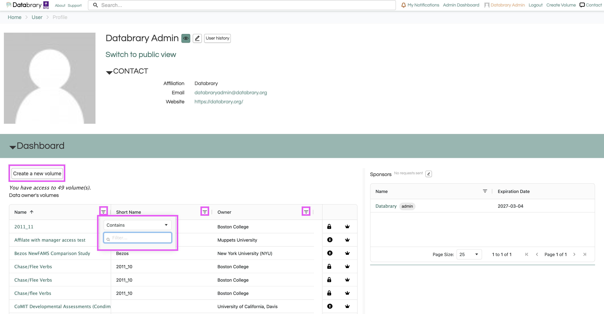
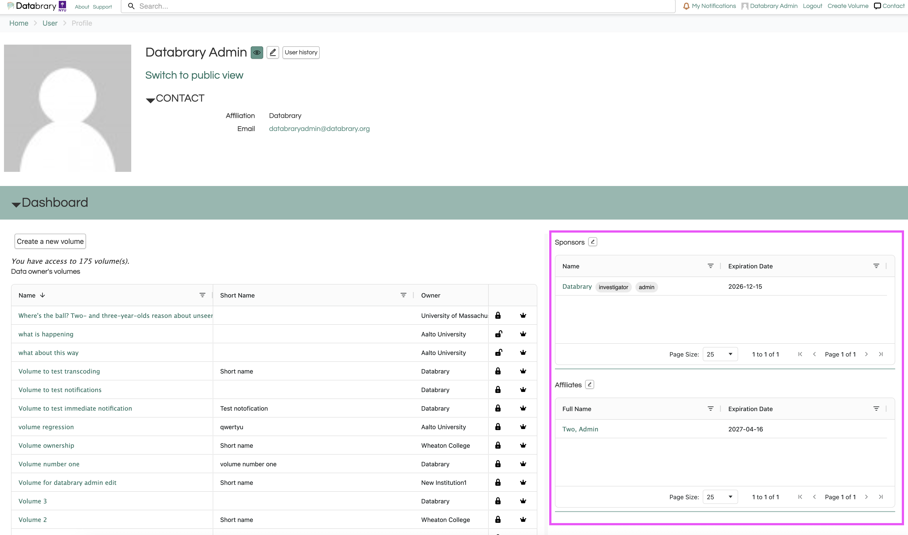
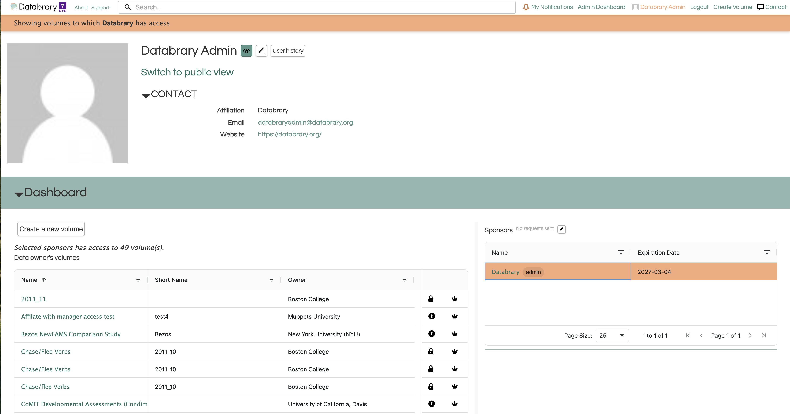

# Profile Management {.unnumbered}

Through your Databrary profile, you can view and manage your volumes, sponsors, sponsored researchers, and account settings.

## Profile Dashboard {-}

### Volumes {-}

Your dashboard displays all of your volumes and/or volumes that you have access to as a collaborator or sponsored researcher. 

```{r echo=FALSE}

```

Through your dashboard, you can create a new volume and search for a specific volume or volume owner through your volume list.

```{r echo=FALSE}

```

### Sponsors and Sponsored Researchers {-}

Your dashboard also displays your sponsors and your sponsored researchers, if applicable. 

```{r echo=FALSE}

```

Selecting a sponsor or sponsor researcher from your list will highlight all the volumes in your volume list that the selected person has access to.

```{r echo=FALSE}

```

For more information about how to manage your sponsored researchers, see [this section](/managing-my-sponsored-researchers.qmd)  