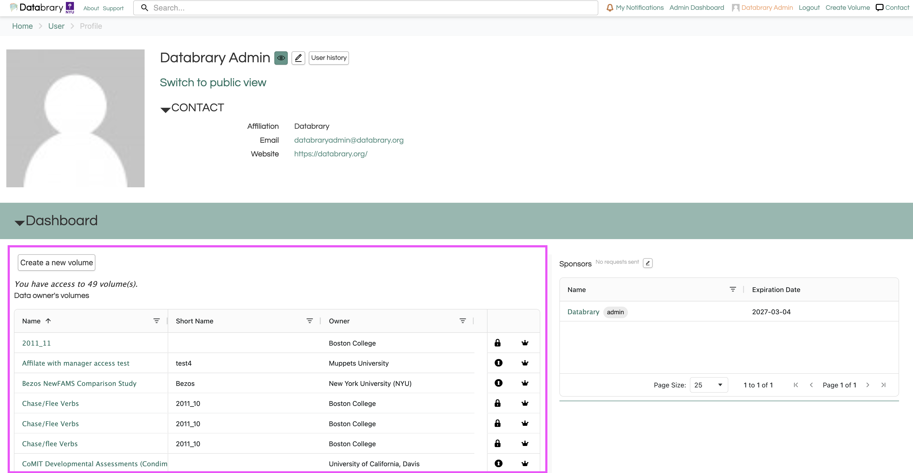
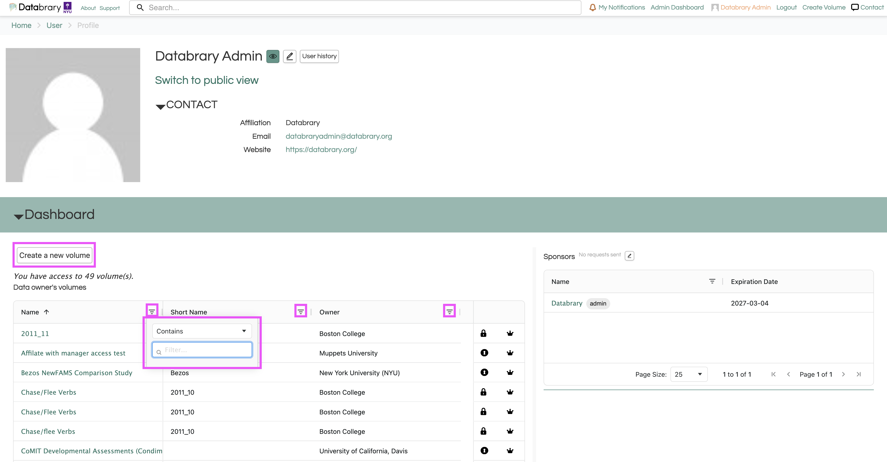
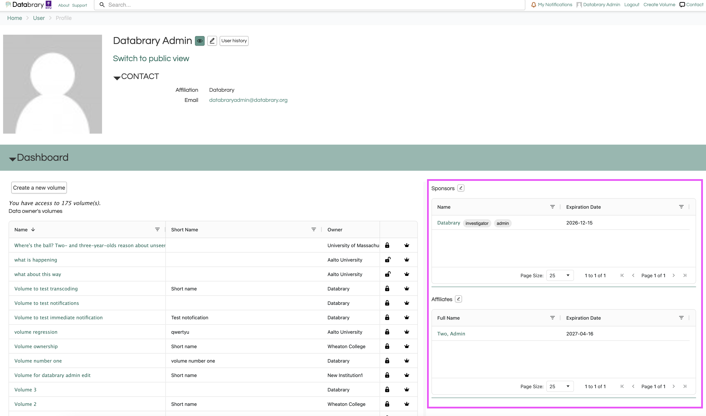

# Profile Management {.unnumbered}

Through your Databrary profile, you can view your sponsors (authorizing institutions and/or supervisors) and manage your volumes, affiliates (supervised researchers), and account settings.

## Profile Dashboard {.unnumbered}

### Volumes {.unnumbered}

Your dashboard displays all of your volumes and/or volumes that you have access to as a collaborator or affiliate (supervised researcher).

```{r echo=FALSE}

```

Through your dashboard, you can create a new volume and search for a specific volume or volume owner through your volume list.

```{r echo=FALSE}

```

### Sponsors (Authorizing Institutions and/or Supervisors) and Affiliates (Supervised Researchers) {.unnumbered}

Your dashboard also displays your sponsors (authorizing institutions and/or supervisors) and your affiliates (supervised researchers), if applicable.

```{r echo=FALSE}

```

For more information about how to manage your affiliates (supervised researchers), see [this section](/managing-my-sponsored-researchers.qmd).
