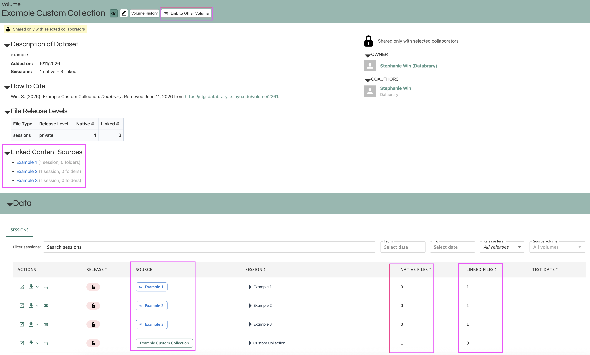

# Custom Collections {.unnumbered}

A custom collection, is a volume that unifies sessions, folders, and files from one or more other volumes and presents it all in one place. The original data stays in the original volume; the custom collection just copies and links to it.

Any volume on Databrary can become a custom collection. As soon as a volume contains at least one link to data in another volume, it is treated and displayed as a custom collection. In a custom collection, you can view the linked volumes, the number of uploaded and linked files, and link data to your other volumes.

^[Databrary is grateful to the support from the U.S. National Science Foundation “Collaborative Research: HNDS-I: Enhancing Infrastructure For Discovery About Human Behavior”, NSF 2444730 and NSF 2444731. The project period is March 1, 2025 to February 28, 2027.]

```{r echo=FALSE}

```

## Why Should I Use Custom Collections?
blurb 

- Lego dataset, primary volume is original data and secondary volume can be annotations created using the original data. Original data and secondary analysis
- Collection of clips a researcher may want to show in class

## Custom Collection Key Terms

### Link Types

**- Linked volume:** An entire volume is linked into the custom collection. All of its sessions and folders appear in the destination.

**- Linked session:** A single session from another volume is linked into the custom collection.

**- Linked folder:** A single folder from another volume is linked into the custom collection.

**- Linked file:** A single file from another volume is linked into a specific session or folder in the custom collection. 

### Content Categories

**- Native content:** Sessions, folders, and files that were created or uploaded directly in the custom collection. These belong to the collection and are not linked from anywhere else.

**- Linked content:** Sessions, folders, and files that originate in a source volume and are linked into the custom collection. They are displayed in the collection but owned by the source volume.

**- Added content:** Files uploaded directly into a linked session or folder within the custom collection. They live in the collection only — they do not appear in the source volume. They behave like native files for editing purposes.

### Records (Metadata)

**- Source records:** Records, like participant metadata, that belong to the source volume and move with the linked content. They appear in the collection as read-only and are not edittable.

**- Supplementary records:** Records created in the custom collection and manually assigned to linked content. They exist only within the collection and can be edited or removed by collaborators with write access to the collection.


