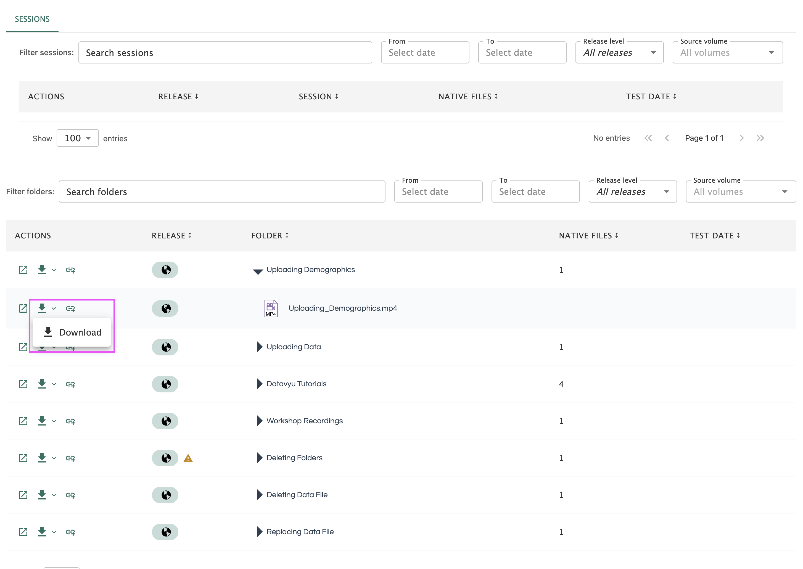
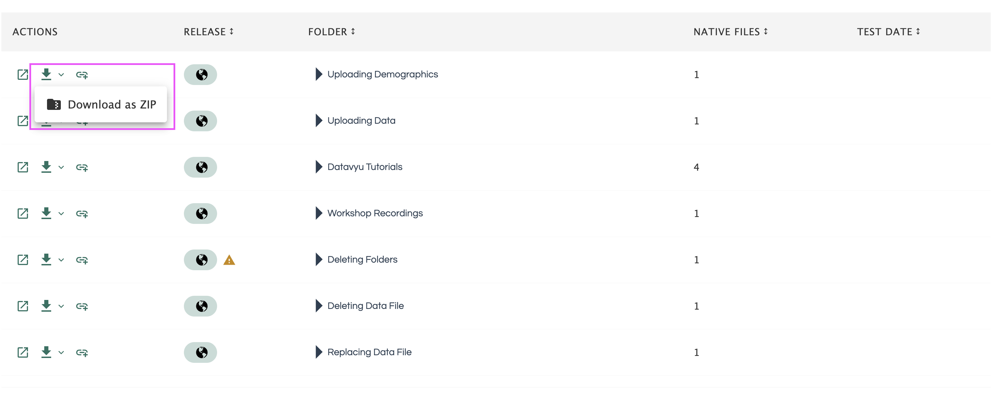
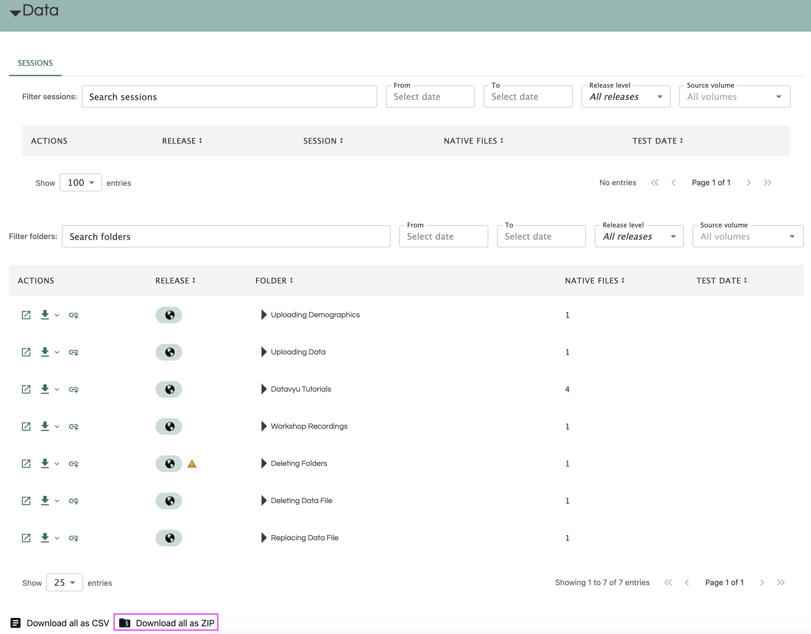
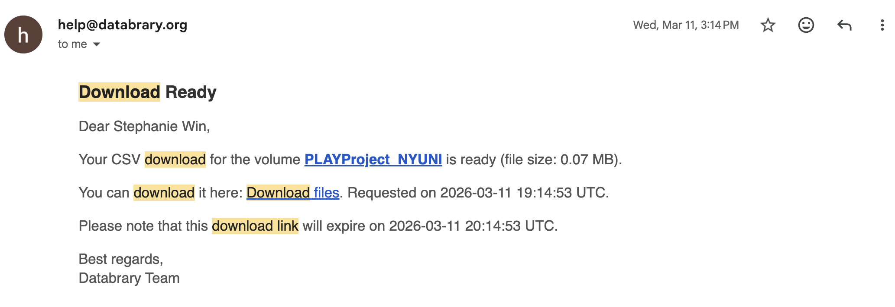

# Downloading Data {.unnumbered}

Downloading data from Databrary is a two-step process.

## Download a Single File
To download a single file, select the file and click the 'Download' button. This will download the data in a format that is compatible with the Databrary platform. 

```{r echo=FALSE}

```

<!-- If the video provided in the single session is not transcoding properly, seek the original data by downloading original data. The Download Original button offers an option to download the exact file uploaded from the manager of the volume. --> 

## Download as ZIP
When a file is compressed by Databrary, the name of the file with be prepared with the pathway to find the file. If the file is intended to be used for further analysis, it is important to rename the file to a more descriptive name. The adapted name may interrupt data mining such as the file name "session1" may be renamed to "001-session1". In this case, consider downloading the original data to avoid from renaming massive files.

If you are downloading big sessions, folders, and/or files, downloading is not immediate and it will take a while for Databrary to prepare the data for download. If you are encountering downloading issues, you can try to download the data in smaller chunks.

It is also important to think about your available local storage space when downloading big sessions and/or files. 


### Downloading a Single Session or Folder as ZIP

To download a single session or folder as a ZIP, select the session or folder and click the 'Download' button. This will download the data in a format that is compatible with the Databrary platform. 

```{r echo=FALSE}

```

### Downloading Volume as ZIP

To download all the data from a volume as a ZIP, scroll to the bottom of the page and click 'Download all as ZIP'. This will download the data in a format that is compatible with the Databrary platform. 

```{r echo=FALSE}

```

## Download Links

Once your download is ready, you will receive an email with the download link. 

```{r echo=FALSE}

```

::: {.callout-note}
Your download link has an expiration. If your download link expires before you are able to download the data to your local computer, you will have to download the data from Databrary again.
:::  