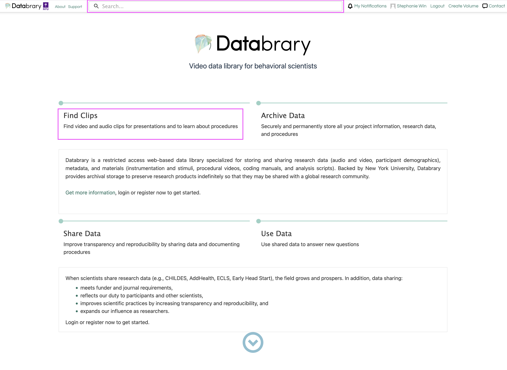
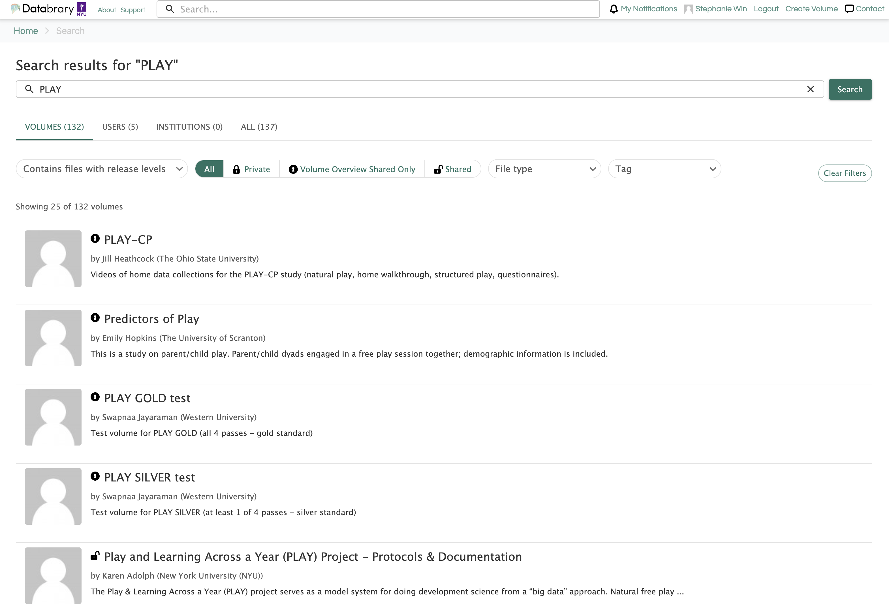
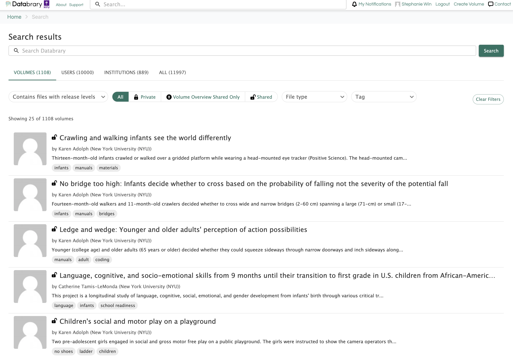

# Finding Datasets {.unnumbered}

To find data on Databrary, you can use the search page to find a specific volume or browse all volumes.

## Search Page
On Databrary's home page, you can use the **search bar** to find datasets or click on 'Find Clips' to browse our **explore page**.

```{r echo=FALSE}

```

Using the search bar will display all volumes with your defined query. You can sort volumes by release levels, volume sharing status, file type, and tags on this page.

```{r echo=FALSE}

```

Our explore page displays all volumes hosted on Databrary. You can refine your search here by using the sorting options or defining a query using the search bar.

```{r echo=FALSE}

```

## Popular Volumes
This page lists some Databrary volumes that are especially popular and widely accessed.

- [The Complex Emotion Expression Database (CEED)](https://databrary.org/volume/874)
- [Child Affective Face Expression (CAFE)](https://databrary.org/volume/30)
- [Eye-Gaze FoCuS Database](https://databrary.org/volume/884)
- [Falls Experiences by Older Adult Residents in Long-Term Care Homes](https://databrary.org/volume/739)
- [ManyBabies 1: Walkthrough videos](https://databrary.org/volume/896)
- [MetroBaby](https://databrary.org/volume/8)
- [SayCAM](https://databrary.org/volume/564)
- [Science of Everyday Play](https://databrary.org/volume/1612)
- [SEEDLingS](https://databrary.org/party/61)
