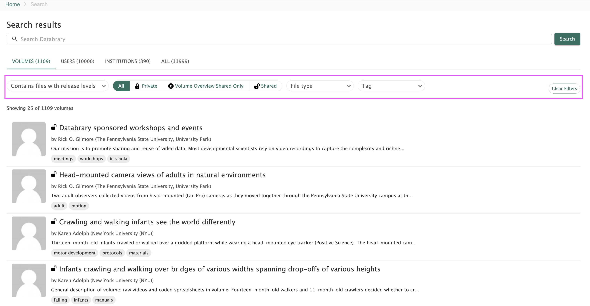
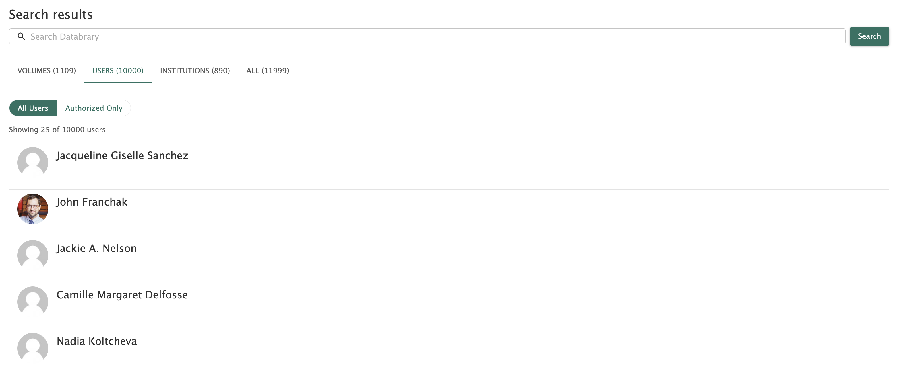
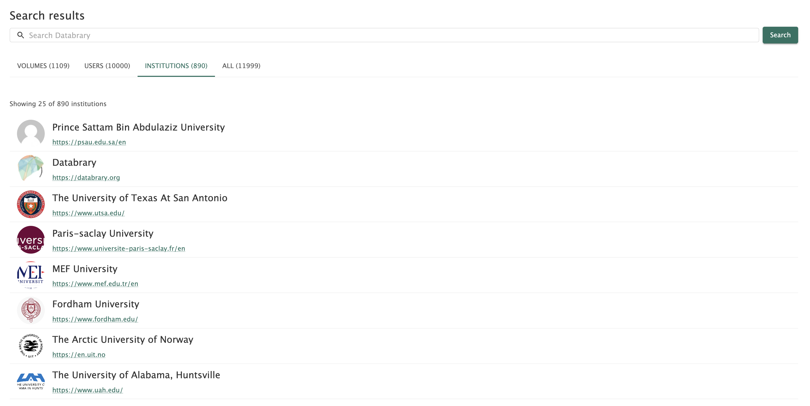

# Finding Datasets {.unnumbered}

To find data on Databrary, you can use the search page to find a specific volume or browse all volumes.

*You are only seeing volumes that are private from other researchers.  Explain users and institutions search page more. Break down components of page more.*

## Search Page- Volumes
On Databrary's home page, you can use the **search bar** to find datasets or click on **'Find Clips'** to browse our all volumes.

```{r echo=FALSE}
knitr::include_graphics("img/homepage-search.png")
```

Using the search bar will display all volumes with your defined query. The returned results are ordered off of relevance. You can sort volumes by release levels, volume sharing status, file type, and tags on this page.

```{r echo=FALSE}
knitr::include_graphics("img/search-page.png")
```

### Filter Options
You can refine your search by using the filter options at the top of the volume list.

```{r echo=FALSE}

```

#### **File Release Levels**
You can sort volumes by public, authorized users, or learning audiences release levels.

#### **Volume Sharing Levels**
You can sort volumes by private, overview only, or shared levels.

::: {.callout-important}
If you want to reuse data, you must find **shared** volumes. 
:::

#### **File Type**
You can sort volumes by video, audio, image, document, or other file types.

#### **Tag**
You can enter a specific tag you are interested in to return volumes associated with that tag. 

::: {.callout-note}
The search function only returns volumes and does not return queries including specific files or sessions. Databrary is planning to implement this functionality in the near future.
:::

## Search Page- Users
You can also use the search page to find other Databrary users. On this page, you can view all users, authorized only users and all users' email addresses.

```{r echo=FALSE}

```

::: {.callout-note}
The email addresses in the screenshot above have been covered for privacy purposes.
:::

## Search Page- Institutions
Lastly, you can use the search page to find institutions registered on Databrary.

```{r echo=FALSE}

```

## Popular Volumes
This page lists some Databrary volumes that are especially popular and widely accessed.

- [The Complex Emotion Expression Database (CEED)](https://databrary.org/volume/874)
- [Child Affective Face Expression (CAFE)](https://databrary.org/volume/30)
- [Eye-Gaze FoCuS Database](https://databrary.org/volume/884)
- [Falls Experiences by Older Adult Residents in Long-Term Care Homes](https://databrary.org/volume/739)
- [ManyBabies 1: Walkthrough videos](https://databrary.org/volume/896)
- [MetroBaby](https://databrary.org/volume/8)
- [SayCAM](https://databrary.org/volume/564)
- [Science of Everyday Play](https://databrary.org/volume/1612)
- [SEEDLingS](https://databrary.org/party/61)
