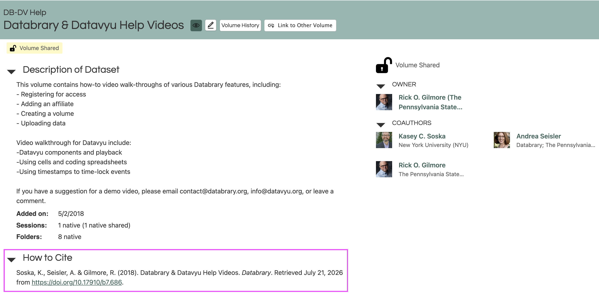

# Using Data {.unnumbered}

The materials and data on Databrary are intended to accelerate discovery. The Databrary Access Agreement and Annexes and the Terms and Conditions of Use provide formal guidance about policies related to contributing and using data.

The data on Databrary can be used for [research purposes](#research-purposes) and [non-research purposes](#non-research-purposes). 

Databrary is structured on a framework of open sharing with restricted access. Open sharing on Databrary allows researchers to reuse data without contacting the original data contributor. However, access to Databrary is restricted to authorized investigators who have completed the formal agreement between the researcher's institution and New York University, the host institution for Databrary. The formal agreement states that the researcher is affiliated with their institution and that the institution will be responsible for the researcher's relationship with Databrary.

::: {.callout-note}
Most of the data shared on Databrary are consistent with broad consent, meaning that participants or parents have given permission for unspecified future uses of the data. Even if you are not consenting human participants for research, your activities still constitute human-subjects research and thus require oversight from the ethics board or IRB at your institution.
:::

## Research Purposes {#research-purposes}
Research uses almost always require ethics board or IRB approval. Please consult your institution's ethics board or IRB to determine whether your intended use is or is not considered research and proceed accordingly. 

For guidance, here is what the [NIH constitutes as research](https://irbo.nih.gov/irb-review/not-human-subjects-research/#frequently-asked-questions).

### Secondary Research Reuse
Secondary research involves conducting secondary analyses of participant data obtained from Databrary. Participants’ consent for study participation and release of data must have been obtained by the original researcher under the oversight of their institutional review board.

For more information about secondary research, see the [Data Reuse page](../ethics/data-reuse.qmd).

## Non-Research Purposes {#non-research-purposes}

### Lectures and Talks
You can also use data on Databrary for non-research purposes, like lectures and talks. The data must have obtained the correct participant permissions and be shared on Databrary with public {style="height: 1em; width: auto;"} or learning audiences {style="height: 1em; width: auto;"} release levels. These release levels permit an authorized user to show clips or excerpts in public settings like classrooms and talks, even if that presentation is video-recorded.

For more information about release levels, see the [Sharing Release Level section](../ethics/data-collection-and-permissions.qmd).

::: {.callout-important}
Data that is released as authorized user or private may not be used for lectures and talks.

However, in lab meeting contexts ie., informal conversations, small lab meetings, it may be appropriate to use data released at the authorized user level to discuss research.

If there are people who are **not** on your IRB protocol in the meeting, you **must** use data released at the learning audiences or public level.
:::

## How to Cite 

<!-- ### Your Own Data -->
<!-- Text about directing people to specific resources. Getting credit for your own work.

Mention different use cases. Volume ID 955
-->

### Reused Data
Shared data should have a citation on the volume profile page in the ‘How to Cite’ section Citations take the format of:

> LastName, FirstInitial. (year volume was added). Title of Volume. Databrary. Retrieved Month DD, YYYY from [link to assigned DOI].

> Soska, K., Seisler, A. & Gilmore, R. (2018). Databrary & Datavyu Help Videos. Databrary. Retrieved February 7, 2023 from http://doi.org/10.17910/B7.686.

```{r echo=FALSE}

```

### Databrary
Citations take the format of:

> Databrary. (2014). Databrary.org. https://nyu.databrary.org/

> Datavyu Team (2014). Datavyu: A Video Coding Tool. Databrary Project, New York University. URL http://datavyu.org.

### DOIs
Once your volume is shared, a Digital Object Identifier(DOI) will be automatically minted for your volume. If you need a reference and you are citing the source of your data, it is best to use the citation. If you would like to direct people to your data, it is best to use the DOI.

## Ethics of Reusing Data
Authorized researchers must secure institutional approvals prior to conducting research with data shared on Databrary. 

For more information about secondary reuse, see the [Data Reuse page](../ethics/data-reuse/secondary-reuse.qmd).
